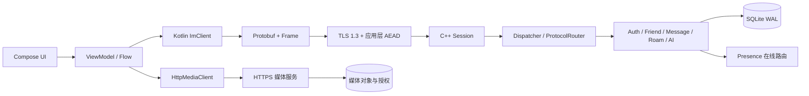
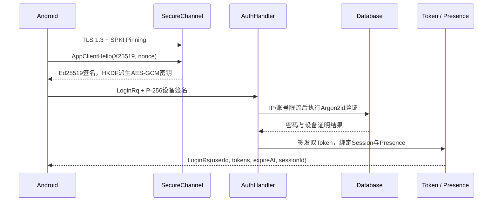
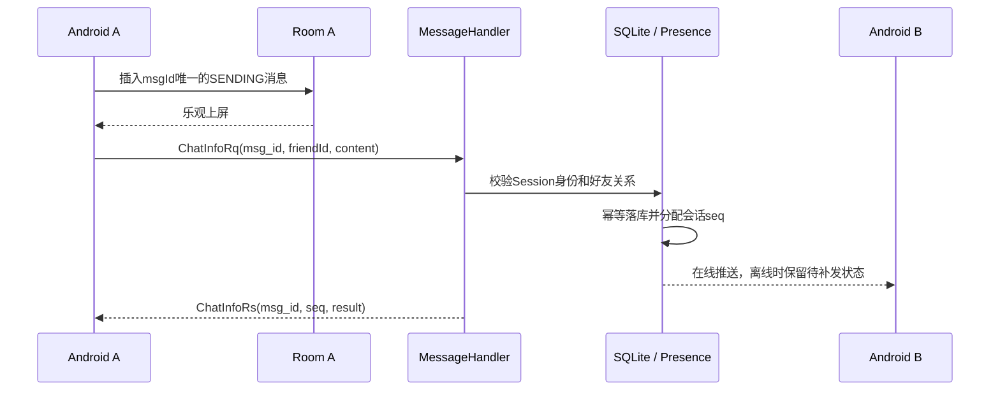
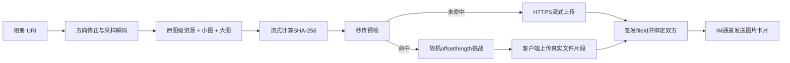

# 即通 App

即通是一个完整可运行的 Android C2C 即时通信项目：Android 客户端使用 Kotlin 与 Jetpack Compose，服务端使用 C++17 与 standalone Asio，双方通过共享 Protobuf 协议通信。项目覆盖安全登录、好友关系、实时消息、离线补发、历史漫游、本地加密搜索、图片与文件传输、秒传，以及 AI 候选回复。

> 项目目标不只是“能聊天”，而是把身份认证、消息顺序、失败恢复、本地存储和富媒体传输串成一条可验证的 IM 工程链路。

## 核心能力

- **安全账号**：注册、密码登录、Token 登录、Access/Refresh Token 轮换、设备签名、登录限流和下线处理。
- **好友关系**：好友申请、申请列表、接受/拒绝、删除好友和在线状态。
- **C2C 消息**：文本、图片、文件、服务端回执、`msg_id` 幂等和会话级 `seq` 排序。
- **离线与漫游**：消息先落库再推送，重连后补发，历史消息使用 `seq` 游标分页。
- **本地搜索**：Room + FTS4，支持中文、完整拼音、拼音首字母和命中汉字高亮。
- **图片体验**：等比占位、小缩略图、大缩略图和原图分级加载，支持超长图预览和 Range 续传。
- **文件秒传**：SHA-256 预检命中后执行随机片段持有证明，再为本次发送签发独立授权的 `file_id`。
- **AI 辅助回复**：服务端组装有限会话上下文并调用可替换模型接口，客户端只展示候选，不自动代替用户发送。

## 系统架构



系统将两类负载分开处理：

| 通道 | 承载内容 | 设计目标 |
| --- | --- | --- |
| 安全 IM 长连接 | 登录、心跳、好友、文本消息、AI请求、媒体元数据 | 低延迟、双向推送、统一会话状态 |
| HTTPS 媒体通道 | 图片和文件真实字节 | 流式传输、秒传预检、Range续传、独立限流 |

大文件不会进入 IM Session 的有序写队列，从而避免阻塞心跳、回执和文本消息。

## 协议与消息边界

实时业务使用共享的 `protocol/im.proto`。TCP 是字节流，项目在 Protobuf 外增加固定帧头：

```text
[4B 大端包长 = 4 + payload长度]
[4B 小端协议号]
[Protobuf payload]
```

包长使用网络字节序；协议号的小端格式用于兼容早期桌面端协议。Android 与 C++ 均显式进行 BE/LE 编解码，不依赖 CPU 原生字节序。接收端限制最大帧长度、校验协议号、Protobuf 和加密标签；长度越界或加密状态失步时关闭连接，通过 Token 重连，再利用消息幂等与补洞恢复状态。

## 登录与传输安全



安全机制分层解决不同问题：

- **TLS 1.3 + SPKI Pinning**：保护标准传输并限制服务端公钥，降低中间人风险。
- **X25519 + Ed25519 + HKDF-SHA256 + AES-256-GCM**：在 TLS 之上建立应用会话密钥、方向隔离密钥和严格序列号状态。
- **Android Keystore P-256**：设备私钥不可导出；密码登录、Token登录、刷新和退出签名绑定当前应用会话与操作。
- **Argon2id**：服务端使用随机盐和约 64 MiB 内存成本保存密码验证器，提高数据库泄露后的离线破解成本。
- **Access/Refresh Token**：短期访问令牌与可轮换刷新令牌分离；检测刷新令牌重放时撤销对应令牌家族。
- **登录限流**：先按 IP 和账号限流、校验输入，再执行昂贵的 Argon2id，降低爆破与计算型 DoS 风险。

当前客户端会对密码做 SHA-256 预处理，它仍可能成为密码等价物；项目依赖加密通道、设备签名和会话绑定降低重放风险。更强的后续方案是 PAKE、新设备二次确认和风险控制。

## 消息幂等、顺序与恢复

`msg_id` 与会话 `seq` 解决不同问题：

- `msg_id`：由客户端发送前生成，用于重试去重以及关联本地占位消息与服务端回执。
- `seq`：由服务端为每个会话分配，是在线、离线和漫游消息的权威顺序。



客户端超时重试时复用原 `msg_id`；服务端依靠唯一约束返回第一次处理产生的 `seq`，不重复落库。客户端收到 `seq=108` 而连续水位只有105时，暂存108并拉取106—107，补齐后才推进连续水位。双方同时发送时允许本地短暂顺序不同，收到服务端 `seq` 后最终收敛一致。

## 本地数据库与搜索

Android 每个账号使用独立的 SQLCipher Room 数据库，核心字段包括：

| 字段 | 用途 |
| --- | --- |
| `ownerId` | 当前本地账号隔离 |
| `conversationId` | 会话归属 |
| `msgId` | 消息幂等去重 |
| `seq` | 会话内权威排序、分页和补洞 |
| `type/content` | 文本或媒体类型及正文 |
| `status` | SENDING、DELIVERED、OFFLINE_STORED、FAILED等状态 |
| 媒体字段 | fileId、本地路径、哈希、尺寸、MIME和下载状态 |

消息主查询使用 `(ownerId, conversationId, seq)` 索引。文本消息写入时，在同一 Room 事务中生成正文、完整拼音和首字母索引并写入 FTS4；历史索引缺失时可由主消息表重建。

搜索链路为：

```text
输入关键词
→ 取消旧搜索任务并防抖
→ FTS4检索content/pinyin/initials
→ 中文正文LIKE兜底
→ 按msgId合并去重
→ 根据拼音音节与字符映射高亮原文
```

## 图片与文件

发送图片时，客户端读取 EXIF 方向和尺寸，并使用采样降低超大图 OOM 风险。当前生成：

- 原图级资源：统一到稳定的 sRGB/JPEG 路径，限制最大边并保持较高质量。
- 小缩略图：用于聊天列表快速首屏。
- 大缩略图：图片进入可视区域后预取。

发送端把原始宽高随消息元数据传递，接收端在下载前即可创建稳定的等比气泡。点开图片时按“本地原图 → 下载原图 → 大缩略图 → 小缩略图 → 占位图”逐级降级。



下载写入 `.part` 临时文件，通过 HTTP Range 从断点继续；完成后校验 SHA-256，再原子替换正式缓存。数据库只保存媒体引用和状态，不保存大体积 BLOB。

## AI 候选回复

客户端只提交目标会话、语气和候选数量，不保存上游 API Key。服务端验证登录与好友关系，从权威消息存储中裁剪最近文本，在独立工作线程调用模型，并限制单用户频率、并发数、全局队列和重复 `request_id`。

模型最多返回三条安全长度内的候选。用户点击候选只会填入输入框，最终发送仍需用户确认。AI故障不会阻塞登录、心跳和消息收发主链路。

## 目录结构

```text
IMproject-main/
├── protocol/                 # im.proto及C++生成代码
├── jitong_android/           # Kotlin + Compose Android客户端
├── im_server/                # C++17 IM服务端
│   ├── src/session/          # Session与Presence
│   ├── src/routing/          # 协议注册与分发
│   ├── src/handlers/         # 认证、好友、消息、漫游、AI
│   ├── src/db/               # SQLite与单写队列
│   ├── src/media/            # HTTPS媒体服务
│   ├── src/auth/             # Token、设备证明、登录限流
│   └── src/crypto/           # 应用层密码学
├── client_core/              # C++通用客户端核心、CLI和测试
└── scripts/                  # 证书、Pin、安全审查和Sanitizer脚本
```

## 环境要求

### Android

- Android Studio与项目匹配的Android SDK
- JDK 17或项目Gradle插件要求的版本
- Android模拟器或真机

### C++服务端

- CMake 3.20+
- 支持C++17的Clang/GCC/MSVC
- OpenSSL、Protobuf、SQLite3、Argon2和standalone Asio

依赖的具体发现方式以 `im_server/CMakeLists.txt` 为准。

## 快速开始

### 1. 准备开发证书和应用身份密钥

将开发环境的 TLS 证书与私钥放在 `im_server/config/dev_server.crt` 和 `im_server/config/dev_server.key`，并把证书 SPKI pin 同步到 Android 开发配置。应用层服务身份密钥可使用现有脚本生成：

```bash
bash scripts/generate_app_identity_key.sh
```

真实私钥、AI密钥、本地数据库、上传文件和构建产物不得提交到仓库。

### 2. 构建并运行C++服务端

```bash
cmake -S im_server -B im_server/build -DIM_SERVER_BUILD_TESTS=ON
cmake --build im_server/build --parallel
./im_server/build/im_server
```

### 3. 构建Android客户端

使用Android Studio打开 `jitong_android/`，配置本机 `local.properties` 和开发服务器地址，然后构建并安装 `app`。也可以执行：

```bash
cd jitong_android
./gradlew :app:assembleDebug
```

### 4. 配置AI能力（可选）

根据服务端示例配置创建本地 `ai.env`，填写所选模型接口和密钥。密钥只保存在服务端本地环境中，不进入Android客户端和Git。

## 测试与安全检查

```bash
# C++测试
ctest --test-dir im_server/build --output-on-failure

# Android单元测试
cd jitong_android && ./gradlew :app:testDebugUnitTest

# 安全与内存检查（回到仓库根目录执行）
bash scripts/security_audit.sh --run-build
bash scripts/native_sanitizer_test.sh
```

服务端E2E测试会使用本机端口，执行前请关闭占用相同端口的开发服务。

## 当前边界

- 当前是客户端到服务端的链路加密，不是用户到用户的端到端加密；服务端需要读取消息以完成落库、漫游和AI上下文处理。
- SQLCipher保护本地聊天数据库，但媒体文件当前主要依赖应用私有目录和系统沙箱，尚未增加独立内容加密。
- 下载支持 Range 与 `.part` 断点恢复；未命中秒传时仍是整文件流式 POST，尚未实现应用层多分片并行上传。
- AI当前返回完整候选结果，不是逐字流式输出。
- 客户端固定SHA-256密码预处理仍属于可改进边界，后续可评估PAKE、新设备二次确认和风险控制。

## 后续计划

- 分片并行上传与断点上传状态持久化。
- 媒体本地内容加密、缓存配额和生命周期回收。
- 新设备确认、设备撤销与登录风险控制。
- 更完整的多设备已读水位同步。
- 网络乱序、ACK丢失、Token重放、极端图片和数据库迁移自动化测试。

## 说明

本项目用于即时通信架构、安全协议、本地存储和AI Coding工程实践。开发证书仅适用于本地环境；生产部署需要独立的证书、密钥管理、日志脱敏、监控告警、数据库备份和安全审计方案。
