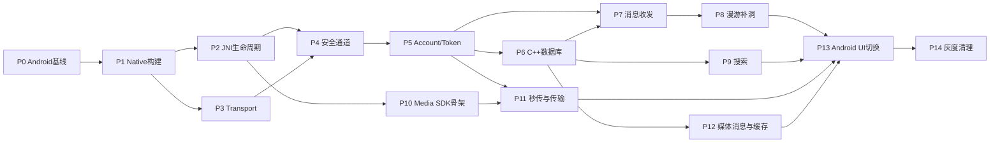

# 即通 QQNT 式薄 UI + 厚内核——可执行任务规划

> 来源：`outputs/jitong-qqnt-thin-ui-thick-kernel-plan-v3.md`
> 执行原则：以当前 Android 行为为兼容基线；每一阶段通过验收门禁后才能切换下一条真实业务链路；禁止新旧核心同时连接或同时写同一份业务数据。

## 0. 使用方法

每个任务统一按下面的闭环执行：

```text
Plan → Implement → Unit Test → Integration Test → Review → Fix → Verify → Commit
```

任务状态：

- `[ ]` 未开始
- `[-]` 执行中
- `[x]` 已完成并通过验收
- `[!]` 阻塞，必须记录原因

完成任务时必须在任务下面补充：

```text
完成提交：<commit>
验证命令：<commands>
验证结果：<result>
遗留问题：<issues or none>
```

## 1. 全局约束

以下规则适用于全部任务：

1. 不删除或覆盖当前 Kotlin 实现，直到 Native Kernel 灰度验收完成。
2. `KernelBackend` 在进程启动前确定，进程运行期间不可热切换。
3. 一个进程只允许一个长连接实现处于活动状态。
4. 一个账号同一时刻只能有一个消息数据库事实源。
5. C++ 网络线程禁止执行数据库写入、图片编码和大文件摘要计算。
6. JNI 回调只复制数据并投递事件，不执行 Kotlin 业务。
7. Token、密码、中间密钥不得写入日志。
8. 所有协议新增字段遵循 protobuf 兼容规则：不修改已使用字段号，不复用删除字段号。
9. 每次迁移必须以当前 Android 行为作为 Golden Test 对照。
10. 构建、单测和关键集成测试失败时禁止进入下一阶段。

## 2. 目标目录

```text
client_core/
├── include/client_core/
│   ├── JitongSdk.h
│   ├── Models.h
│   ├── Events.h
│   └── PlatformServices.h
├── src/
│   ├── sdk/
│   ├── account/
│   ├── transport/
│   ├── message/
│   ├── storage/
│   ├── search/
│   └── media/
└── tests/
    ├── unit/
    ├── integration/
    └── golden/

jitong_android/app/src/main/
├── cpp/
│   ├── CMakeLists.txt
│   ├── im_core_jni.cpp
│   ├── native_sdk_handle.h
│   ├── jni_observer.cpp
│   └── android_platform_services.cpp
└── java/com/jitong/im/core/
    ├── JitongSdk.kt
    ├── NativeBindings.kt
    ├── NativeEventSink.kt
    ├── KernelBackend.kt
    └── platform/
        ├── AndroidKeystoreProvider.kt
        ├── AndroidFileProvider.kt
        ├── AndroidImagePlatform.kt
        ├── AndroidSecureKv.kt
        └── AndroidNetworkObserver.kt
```

## 3. 依赖关系



可并行组：

- P2 JNI 生命周期与 P3 Transport 可并行。
- P9 搜索与 P10/P11 Media SDK 可并行。
- 单元测试与当前模块实现同步进行，不允许最后集中补测试。

---

# P0：冻结 Android 行为基线

## P0-T01 建立基线测试目录

- [ ] 创建 `client_core/tests/golden/`。
- [ ] 创建 `jitong_android/app/src/androidTest/` 对应测试目录。
- [ ] 创建 `outputs/kernel-baseline/` 保存非敏感测试结果。
- [ ] 编写 `BASELINE.md`，声明测试账号、环境、服务端版本和数据清理方法。

验收：

- 测试目录可被 CMake/Gradle 发现。
- 不提交密码、Token、私钥、真实手机号。

## P0-T02 固化登录基线

参考文件：

- `jitong_android/app/src/main/java/com/jitong/im/net/ImClient.kt`
- `jitong_android/app/src/main/java/com/jitong/im/net/SecureChannel.kt`
- `jitong_android/app/src/main/java/com/jitong/im/ui/AuthCoordinator.kt`
- `jitong_android/app/src/main/java/com/jitong/im/ui/MainViewModel.kt`

任务：

- [ ] 记录密码登录请求/响应字段，不记录字段值。
- [ ] 记录 Token Login 分支条件。
- [ ] 记录 Refresh 分支、Single-Flight 和 requestId 复用行为。
- [ ] 覆盖密码错误、Token 过期、Refresh 过期、被踢下线。
- [ ] 覆盖连续点击登录只产生一个认证任务。

验收：

- 每种场景有输入、状态变化、协议类型和最终结果。
- 可以据此判断 Native 行为是否与 Android 一致。

## P0-T03 固化消息和漫游基线

- [ ] 记录发送消息从 `SENDING → SENT/FAILED` 的状态变化。
- [ ] 记录 `msg_id`、`conversation_seq` 和时间字段变化。
- [ ] 覆盖双方同时发送。
- [ ] 覆盖重复包、断线重发、离线消息、历史分页和 seq 缺口。
- [ ] 导出不含敏感正文的结构化 Golden Case。

验收：同一组输入可以在 Kotlin Legacy 和 Native Kernel 上重复执行。

## P0-T04 固化搜索基线

参考文件：

- `data/ChatStore.kt`
- `data/db/Daos.kt`
- `util/PinyinIndex.kt`
- `ui/SearchHighlight.kt`

- [ ] 建立中文、全拼、首字母、拼音前缀、LIKE 子串用例。
- [ ] 加入“你/ni/n”“正/zheng/z”等容易混淆的案例。
- [ ] 保存期望命中 msgId 和汉字高亮区间。

验收：至少 50 个固定搜索用例全部可重复执行。

## P0-T05 固化媒体基线

参考文件：

- `net/HttpMediaClient.kt`
- `util/ImageCodec.kt`
- `ui/MainViewModel.kt`
- `ui/ChatScreen.kt`

- [ ] 覆盖普通图、横长图、竖长图。
- [ ] 覆盖 JPEG、PNG、HEIC、Display P3、EXIF 旋转。
- [ ] 记录三档资源尺寸、摘要、Content-Type 和显示优先级。
- [ ] 覆盖秒传命中、未命中、PoP 失败、下载 404。
- [ ] 保存测试图片的像素摘要或感知哈希，验证颜色没有倒退。

### P0 门禁

- [ ] P0-T01～P0-T05 全部完成。
- [ ] Golden 数据不包含秘密。
- [ ] 当前 Android Debug 构建通过。

---

# P1：打通 Android Native 构建

## P1-T01 CMake 组件化

修改：

- `client_core/CMakeLists.txt`
- `protocol/CMakeLists.txt`

任务：

- [ ] 增加 `CLIENT_CORE_WITH_SQLITE`。
- [ ] 增加 `CLIENT_CORE_WITH_MEDIA`。
- [ ] Android 构建关闭 tests/tools。
- [ ] 宿主机 `protoc` 与 Android 目标 `libprotobuf` 分离。
- [ ] 所有进入共享库的静态库启用 PIC。
- [ ] 保持桌面端原构建路径可用。

验收命令：

```bash
cmake -S client_core -B build/client-core-desktop
cmake --build build/client-core-desktop
ctest --test-dir build/client-core-desktop --output-on-failure
```

## P1-T02 Android externalNativeBuild

修改：

- `jitong_android/app/build.gradle.kts`
- 新建 `jitong_android/app/src/main/cpp/CMakeLists.txt`

任务：

- [ ] 配置 NDK/CMake。
- [ ] 配置 `arm64-v8a` 和 `x86_64`。
- [ ] 接入 OpenSSL Android 目标库。
- [ ] 接入 protobuf C++ Android 运行库。
- [ ] 首阶段关闭 SQLite 和 Media。

验收：两个 ABI 都生成 `libjitong_kernel.so`。

## P1-T03 Native Self Test

新建：

- `im_core_jni.cpp`
- `NativeBindings.kt`

实现：

```text
nativeVersion()
nativeSelfTest()
```

验收：真机和 x86_64 模拟器均返回相同核心版本和 protobuf/OpenSSL 自检结果。

### P1 门禁

- [ ] Desktop C++ 构建没有回归。
- [ ] Android 两个 ABI 构建通过。
- [ ] `.so` 可加载并完成 Self Test。

---

# P2：JNI 生命周期与平台接口

## P2-T01 NativeSdkHandle

新建：

- `native_sdk_handle.h/.cpp`

任务：

- [ ] `jlong` 指向 `NativeSdkHandle`，禁止指向裸 `ClientCore*`。
- [ ] 每次 API 调用在锁内取得 `shared_ptr<JitongSdk>`。
- [ ] `destroying` 后拒绝新调用。
- [ ] `nativeDestroy` 幂等。

## P2-T02 JniObserver

新建：

- `jni_observer.h/.cpp`
- `NativeEventSink.kt`

任务：

- [ ] 缓存 `JavaVM*`、类和 method ID。
- [ ] 正确 New/DeleteGlobalRef。
- [ ] 只在线程由 JNI 临时 Attach 时 Detach。
- [ ] 每次 CallVoidMethod 后检查并清理异常。
- [ ] 回调只入队，不做业务。

## P2-T03 平台原子能力接口

新建：

- `PlatformServices.h`
- `AndroidKeystoreProvider.kt`
- `AndroidFileProvider.kt`
- `AndroidImagePlatform.kt`
- `AndroidSecureKv.kt`
- `AndroidNetworkObserver.kt`

任务：

- [ ] 定义异步签名接口。
- [ ] 定义 URI/FileHandle 读取接口。
- [ ] 定义图片 probe/decode/encode 接口。
- [ ] 定义 opaque secure KV 接口。
- [ ] 所有接口禁止包含 Token、消息、秒传等业务语义。

## P2-T04 生命周期压力测试

- [ ] 创建/销毁 100 次。
- [ ] 回调并发销毁。
- [ ] 后台线程回调 Attach/Detach。
- [ ] 开启 CheckJNI。
- [ ] 使用 ASan 构建跑 UAF 检查。

### P2 门禁

- [ ] 无 UAF、double free、GlobalRef 泄漏。
- [ ] 所有异常转换成 SDK 错误，不能穿透 JNI。

---

# P3：Transport 和消息边界

## P3-T01 重构 TcpTransport 生命周期

修改：

- `client_core/src/TcpTransport.h`
- `client_core/src/TcpTransport.cpp`

任务：

- [ ] 每次 connect 创建新的 socket/TLS stream。
- [ ] 重连前 `io_context.restart()`。
- [ ] 重置 `m_notified/m_closing/writeQueue`。
- [ ] 明确 connect/close 状态机。
- [ ] 禁止工作线程 join 自身。
- [ ] 所有异步 handler 绑定安全生命周期 token。

## P3-T02 帧编解码独立模块

新建：

- `transport/FrameCodec.h/.cpp`

任务：

- [ ] 4B 大端包长编码解码。
- [ ] 4B 小端协议号编码解码。
- [ ] `0 < bodyLen <= MAX_PACK_LEN`。
- [ ] 精确读取 Header 后再精确读取 Body。
- [ ] 非法长度直接关闭连接。
- [ ] 未知协议号可记录并忽略，越界不能访问函数表。

## P3-T03 单写发送队列

- [ ] 所有发送都 post 到 asio executor。
- [ ] 同一时刻只有一个 `async_write`。
- [ ] shutdown 明确处理队列中的未发送请求。
- [ ] 业务回调返回 `CANCELLED/DISCONNECTED`。

## P3-T04 Transport 测试

- [ ] 半包、粘包、1 字节分段。
- [ ] 0 长度、超大长度、错误端序。
- [ ] 连续重连 50 次。
- [ ] 服务端中途关闭。
- [ ] 发送过程中 close。

### P3 门禁

- [ ] 无消息边界错位。
- [ ] 错误包长后可安全断线并新建会话。
- [ ] 重连 50 次无资源增长。

---

# P4：TLS 与应用层安全通道

## P4-T01 TLS 客户端配置

- [ ] TLS 最低版本 1.3。
- [ ] 验证证书链和域名。
- [ ] 设置正确 SNI。
- [ ] 实现 SPKI Pinning。
- [ ] 禁止 `verify_none` 和永久返回 true 的 callback。

## P4-T02 ClientSecureChannel

新建：

- `transport/ClientSecureChannel.h/.cpp`

对齐 `SecureChannel.kt`：

- [ ] X25519 临时密钥。
- [ ] Ed25519 服务端身份签名验证。
- [ ] transcript hash。
- [ ] HKDF-SHA256 派生双向密钥、nonce 和 Finished key。
- [ ] AES-256-GCM。
- [ ] sessionId/sequence/protocol 进入 AAD。
- [ ] 收发 sequence 分离且单调递增。
- [ ] 中间密钥安全清除。

## P4-T03 安全负向测试

- [ ] 错误证书。
- [ ] 错误 SPKI。
- [ ] 错误服务端签名。
- [ ] 修改密文/tag/AAD。
- [ ] 重放 sequence。
- [ ] Finished 不一致。

### P4 门禁

- [ ] 与 Android Golden 握手字段和方向完全一致。
- [ ] 抓包不可看到业务明文。
- [ ] 任意认证失败都不会继续解析业务包。

---

# P5：AccountSession、Token 与防重入

## P5-T01 AuthStateMachine

新建：

- `account/AuthStateMachine.h/.cpp`
- `account/AccountSession.h/.cpp`

状态：

```text
Stopped → Connecting → Handshaking → Authenticating → Authenticated
                    ↘ Backoff → Reconnecting
```

任务：

- [ ] 相同登录请求复用 RequestId。
- [ ] 不同账号并发登录返回 `AUTH_OPERATION_IN_PROGRESS`。
- [ ] UI 按钮禁用不作为正确性保证。
- [ ] 被踢后禁止自动重连。

## P5-T02 DeviceProofService

- [ ] C++ 构造 canonical proof。
- [ ] requestId 关联异步签名结果。
- [ ] 超时/取消后丢弃迟到签名。
- [ ] 平台层只执行 P-256 sign。

## P5-T03 TokenManager

新建：

- `account/TokenManager.h/.cpp`
- `account/TokenStore.h/.cpp`

任务：

- [ ] C++ 解析和保存完整 TokenSession。
- [ ] 启动时自动判断 Access/Refresh 有效期。
- [ ] 实现 Refresh Single-Flight。
- [ ] 持久化 pending requestId。
- [ ] 刷新成功原子轮换 Token。
- [ ] Token reuse 清理 Token family。
- [ ] 等待 Token 的 Socket/HTTP 请求统一恢复或失败。

## P5-T04 自动登录入口

UI 只调用 `sdk.start()`：

- [ ] 无凭证上报 `NeedLogin`。
- [ ] Access 有效自动 Token Login。
- [ ] Access 临期、Refresh 有效自动刷新后登录。
- [ ] Refresh 过期清理并上报 `NeedLogin`。

## P5-T05 认证测试

- [ ] 密码登录成功/失败。
- [ ] Token 登录成功/过期。
- [ ] Refresh 成功/过期/重用。
- [ ] 10 个并发请求触发一次刷新。
- [ ] 刷新途中断线，重连沿用 requestId。
- [ ] 连点登录只发一条认证链路。

### P5 门禁

- [ ] Kotlin UI/ViewModel 不包含 Token 分支和刷新逻辑。
- [ ] Native 自动登录行为通过 Android Golden 对照。

---

# P6：C++ SQLCipher 数据层

## P6-T01 SQLCipher Android 构建

- [ ] 将 SQLCipher C/C++ 库接入 Native 构建。
- [ ] 验证普通 SQLite 无法读取加密数据库。
- [ ] 每账号独立数据库路径。
- [ ] DB key 由 C++ 管理并通过平台安全存储包装。

## P6-T02 Schema 与 Migration

新建：

- `storage/Schema.sql` 或版本化 migration 文件。

表：

- [ ] messages
- [ ] conversations
- [ ] friends
- [ ] message_fts
- [ ] sync_watermarks
- [ ] outbox
- [ ] media_records
- [ ] transfer_tasks

关键约束：

- [ ] `UNIQUE(owner_id,msg_id)`。
- [ ] `(owner_id,peer_id,conversation_seq)`。
- [ ] `(owner_id,peer_id,server_time)`。
- [ ] `(owner_id,status,local_order)`。

## P6-T03 单写线程和只读连接池

- [ ] `DbCommandQueue`。
- [ ] 单个 Writer connection/thread。
- [ ] 查询使用只读连接。
- [ ] 写事务完成后触发 Query invalidation。
- [ ] 网络线程只投递命令，不同步等待磁盘。

## P6-T04 Room 数据迁移器

- [ ] Android 只读分页导出旧数据。
- [ ] C++ 按 msg_id 幂等导入。
- [ ] 重建 FTS。
- [ ] 比对消息数、会话数、max_seq 和抽样摘要。
- [ ] 原子写 `migration_completed`。
- [ ] 中断后可重新执行。

### P6 门禁

- [ ] 数据库加密验证通过。
- [ ] 迁移可中断恢复。
- [ ] 网络线程不执行 SQL。
- [ ] 旧 Room 数据数量与 Native 数据一致。

---

# P7：消息 Outbox / Inbox

## P7-T01 完整消息模型

- [ ] 定义 `MessageId/ConversationId/ConversationSeq` 强类型。
- [ ] 保留 sender/receiver/peer/type/content/time/status。
- [ ] 媒体元数据进入统一 Message 模型。
- [ ] JNI 只输出稳定 DTO/protobuf。

## P7-T02 Outbox

- [ ] 内核生成 msg_id。
- [ ] 先持久化 SENDING。
- [ ] 认证可用后发送。
- [ ] 超时重试使用同一 msg_id。
- [ ] ACK 回填同一行的 seq/time/status。
- [ ] kill 进程后恢复未完成任务。

## P7-T03 Inbox

- [ ] 实时、离线、漫游共用一个入口。
- [ ] `owner_id + msg_id` 幂等。
- [ ] 单事务更新消息、会话和搜索索引。
- [ ] 重复消息不重复通知 UI。

## P7-T04 Query Subscription

- [ ] `observeConversations()`。
- [ ] `observeMessages(conversationId)`。
- [ ] 增量失效通知。
- [ ] JNI/Kotlin 订阅销毁后停止回调。

### P7 门禁

- [ ] 双方同时发送最终 seq 顺序一致。
- [ ] 重发和重复包不产生第二条消息。
- [ ] UI 消息列表只来自 Native Query。

---

# P8：漫游、离线和补洞

## P8-T01 SyncWatermark

- [ ] 持久化每会话 local_max_seq。
- [ ] 保存同步状态和分页 cursor。
- [ ] 重启后恢复未完成同步。

## P8-T02 会话摘要同步

- [ ] 认证成功后自动拉取。
- [ ] 与本地水位比较。
- [ ] 发现缺口创建补洞任务。

## P8-T03 历史分页

- [ ] UI 上报滚动到顶部，不传 beforeSeq。
- [ ] SyncEngine 从数据库读取当前 minSeq。
- [ ] 处理 hasMore/minSeq。
- [ ] 防止相同分页并发。

## P8-T04 补洞测试

- [ ] 缺 1 条、连续多条、页边界缺失。
- [ ] 同步期间收到实时消息。
- [ ] 同步期间断网和进程退出。
- [ ] 服务端重复返回同一页。

### P8 门禁

- [ ] 实时/离线/漫游不重不漏。
- [ ] UI 不计算 beforeSeq 和 seq 缺口。

---

# P9：C++ FTS4、拼音搜索和高亮

## P9-T01 选择并封装 C++ 拼音实现

- [ ] 评估体积、许可证、多音字、Android/桌面支持。
- [ ] 封装为 `IPinyinConverter`，禁止业务依赖第三方 API。
- [ ] 用 P0 Golden Case 验证与 Android 当前结果兼容。

决策门槛：若没有可兼容库，先将当前拼音映射表生成为 C++ 只读数据，不允许改变搜索语义后直接切换。

## P9-T02 入库索引

- [ ] 正文生成 normalized/pinyin/initials。
- [ ] messages 与 FTS4 同事务写入。
- [ ] 历史消息可分批重建。

## P9-T03 查询引擎

- [ ] 中文/普通文本查询。
- [ ] 拼音前缀查询。
- [ ] 首字母查询。
- [ ] LIKE 子串补充。
- [ ] msg_id 去重和游标分页。

## P9-T04 高亮映射

- [ ] 建立拼音 token 到汉字下标映射。
- [ ] 返回 UTF-16 或 Unicode code point 明确语义的区间。
- [ ] Kotlin 只按区间加粗。

### P9 门禁

- [ ] P0 的至少 50 个 Golden 搜索用例全部通过。
- [ ] “n”不会错误匹配“正/真”，但能按产品规则匹配“你”。

---

# P10：Media SDK 骨架与图片流水线

## P10-T01 Media 公共 API

- [ ] `sendImage/sendFile/openImage/cancelTransfer/setVisibleMessages`。
- [ ] `TransferState/ImageDisplayState`。
- [ ] UI API 不暴露缩略图等级选择和 HTTP URL。

## P10-T02 Android File/Image 平台适配

- [ ] Content URI → FileHandle/fd。
- [ ] probe 宽高、EXIF、色彩空间。
- [ ] decode 到明确像素格式。
- [ ] 转换到 sRGB。
- [ ] AVIF 编码。
- [ ] 临时文件和原子 rename。

## P10-T03 ThumbnailPipeline

- [ ] 普通图片完整等比缩放。
- [ ] 横向超长图居中裁剪缩略图。
- [ ] 纵向超长图展示顶部首屏。
- [ ] 原图不裁剪。
- [ ] 生成小图、大图、原图三档元数据。
- [ ] 原始宽高进入 MediaCard。

## P10-T04 色彩与像素测试

- [ ] Display P3 → sRGB。
- [ ] HEIC/HDR 输入。
- [ ] EXIF 90/180/270。
- [ ] 对比 Android 基线像素或感知哈希。

### P10 门禁

- [ ] 不再出现粉色/绿色滤镜。
- [ ] 长图缩略图符合基线。
- [ ] UI 无图片处理决策。

---

# P11：秒传、分片、下载和取消

## P11-T01 StreamingHash

- [ ] 64 KiB 或配置化缓冲流式 SHA-256。
- [ ] 支持进度和取消。
- [ ] 不把大文件整体加载内存。

## P11-T02 InstantUploadClient / PoP

- [ ] 提交 sha256/size/contentType/receiverId。
- [ ] 校验 challenge offset/length 不越界。
- [ ] 从同一文件身份读取指定片段。
- [ ] `SHA-256(nonce || chunk)`。
- [ ] 服务端授权完成后再返回成功。
- [ ] 文件在计算期间改变时拒绝秒传。

## P11-T03 ChunkUploader

- [ ] upload_id 与 checkpoint。
- [ ] chunk hash。
- [ ] 并发窗口和带宽限制。
- [ ] 指数退避。
- [ ] 网络恢复续传。
- [ ] 完整摘要校验。

## P11-T04 RangeDownloader

- [ ] `.download` 临时文件。
- [ ] HTTP Range。
- [ ] ETag/文件摘要防止错误续传。
- [ ] 完成后摘要校验和原子 rename。
- [ ] 失败删除或保留可恢复 checkpoint。

## P11-T05 任务生命周期

- [ ] TransferTask 由 `shared_ptr` 管理。
- [ ] 回调捕获 `weak_ptr`。
- [ ] 回主执行器前 `lock()`。
- [ ] cancel 后不再上报 Completed。
- [ ] SDK destroy 等待任务安全停止。

### P11 门禁

- [ ] 秒传命中不上传整文件。
- [ ] 1 GiB 测试文件内存占用保持有界。
- [ ] 中断续传成功。
- [ ] 取消/销毁压力测试无 UAF。

---

# P12：媒体消息、缓存和分级加载

## P12-T01 MediaRecord

- [ ] 保存 original/small/large 的 fileId、sha256、path 和状态。
- [ ] 消息数据库与媒体记录保持事务关联。
- [ ] 服务端 404 区分失效索引和临时网络错误。

## P12-T02 MediaCard

- [ ] 上传成功和授权完成后发送 MediaCard。
- [ ] 携带原始宽高、三档索引、Content-Type、size、sha256。
- [ ] 接收、离线和漫游使用同一个解析入口。

## P12-T03 DownloadScheduler

- [ ] `file_id + variant` 单飞。
- [ ] P0～P4 优先级队列。
- [ ] UI 可见消息只作为输入信号。
- [ ] 点击原图抢占低优先级后台预取。

## P12-T04 ImageDisplayState

- [ ] OriginalReady。
- [ ] LargeThumbnailReady + 原图下载中。
- [ ] SmallThumbnailReady + 升级中。
- [ ] Placeholder(width,height)。
- [ ] Failed(retryable)。

### P12 门禁

- [ ] UI 只渲染当前最佳资源。
- [ ] 图片升级时气泡尺寸不变化。
- [ ] 点击优先显示本地最高质量并请求原图。

---

# P13：Android UI 切换

## P13-T01 KernelBackend

新建：

- `KernelBackend.kt`
- `JitongSdk.kt`

- [ ] 启动时确定 Legacy/Native。
- [ ] 进程内不可修改。
- [ ] 确保只创建一个连接核心。

## P13-T02 LoginScreen/MainViewModel

- [ ] 登录页只调用 `sdk.login()`。
- [ ] 启动只调用 `sdk.start()`。
- [ ] 删除 Native 路径中的 Token 判断、refresh 和 reconnect 编排。
- [ ] UI 只映射 `AccountState/ConnectionState`。

## P13-T03 Conversation/Chat

- [ ] 会话和消息只订阅 Native Query。
- [ ] sendText/sendImage/sendFile 只调用 SDK。
- [ ] UI 不直接写 Room。
- [ ] UI 不解析 protobuf。

## P13-T04 Search

- [ ] 查询交给 SDK。
- [ ] 直接使用内核返回 highlightRanges。
- [ ] UI 只绘制加粗区间。

## P13-T05 Image UI

- [ ] 上报 visible message IDs。
- [ ] 点击调用 `sdk.openImage(msgId)`。
- [ ] 根据 ImageDisplayState 渲染。
- [ ] 保持 width/height 等比占位。

### P13 门禁

- [ ] Native 模式下 ViewModel 不含业务状态机。
- [ ] P0 所有 Android Golden Case 通过。

---

# P14：灰度、性能和清理

## P14-T01 指标

- [ ] 登录成功率和时延。
- [ ] Token 刷新成功率。
- [ ] 消息发送成功率、重复率、缺失率。
- [ ] 重连次数和恢复时延。
- [ ] 数据库写入/查询耗时。
- [ ] 搜索耗时。
- [ ] 秒传命中率和节省字节。
- [ ] 缩略图/原图下载流量。
- [ ] Native 崩溃、ANR、内存和线程数。

## P14-T02 灰度顺序

- [ ] 开发者开关。
- [ ] 内部测试账号。
- [ ] 小比例设备。
- [ ] 扩大比例。
- [ ] Native 默认开启。

任一核心指标显著劣化时停止扩大并回退到 Legacy 重启。

## P14-T03 删除旧实现

只有所有门禁通过后才允许：

- [ ] 删除 Kotlin `ImClient` 协议实现。
- [ ] 删除 Kotlin `SecureChannel/AppCrypto` 业务路径。
- [ ] 删除 ViewModel Token 刷新代码。
- [ ] 删除 ViewModel 媒体上传下载编排。
- [ ] 将旧 Room 数据库改为只迁移工具或移除。
- [ ] 更新 README、架构图和答辩材料。

### P14 最终门禁

- [ ] 所有 P0 Golden Case 通过。
- [ ] Native 核心至少完成一轮真实灰度。
- [ ] 无已知 P0/P1 崩溃、UAF、丢消息和数据损坏问题。
- [ ] Android 与桌面端实际复用同一 C++ 业务模块。

---

## 19. 每次提交建议

建议按任务提交，不要按阶段积累成超大提交：

```text
build(native): add Android core shared library
feat(jni): add safe NativeSdkHandle lifecycle
refactor(transport): make TLS transport reconnectable
feat(security): add client application secure channel
feat(auth): move token lifecycle into native AccountSession
feat(storage): add SQLCipher message store and DB writer
feat(message): add persistent outbox and idempotent inbox
feat(sync): add roam pagination and seq gap recovery
feat(search): add native FTS4 pinyin search and highlights
feat(media): add thumbnail pipeline and Android image adapter
feat(transfer): add PoP instant upload and resumable chunks
feat(android): switch UI to JitongSdk native backend
chore(legacy): remove duplicated Kotlin protocol stack
```

## 20. 执行前必须确认的技术决策

这些决策必须在对应阶段开始前形成 ADR，不能边写边猜：

- [ ] ADR-001：C++ protobuf Android runtime 的来源和版本策略。
- [ ] ADR-002：OpenSSL/SQLCipher/libavif 的构建与升级策略。
- [ ] ADR-003：C++ 拼音库选择及许可证。
- [ ] ADR-004：数据库密钥生成、包装、恢复和登出销毁。
- [ ] ADR-005：JNI DTO 使用 protobuf envelope 还是稳定手写 DTO。
- [ ] ADR-006：媒体文件通过临时路径还是 fd 交给 C++。
- [ ] ADR-007：Token SecureString 和内存清理边界。
- [ ] ADR-008：Legacy Room 到 Native SQLCipher 的迁移和回退策略。
- [ ] ADR-009：后台保活、Android 网络变化与系统限制的边界。
- [ ] ADR-010：缩略图规格、长图阈值和 AVIF 质量参数。

## 21. 第一轮建议执行范围

第一轮只执行到 P2，不立即迁移真实登录：

```text
P0 Android基线
→ P1 Native构建
→ P2 JNI生命周期和平台接口
```

第一轮交付物：

- Android 行为 Golden Case；
- 两个 ABI 的 `libjitong_kernel.so`；
- 可安全创建销毁的 Native SDK；
- 平台原子能力接口；
- CheckJNI/ASan 验证结果；
- 不影响当前 Kotlin 客户端的关闭状态 Native 开关。

完成上述范围后，再开始 P3/P4 网络与安全通道迁移。

## 22. 第二轮工作与验收范围：P3 Transport + P4 安全通道

> 第二轮目标不是迁移登录、Token、数据库、消息或媒体业务，而是先建立一个可重连、
> 边界明确、默认安全的 C++ 网络底座。完成后，旧 `test_e2e` 必须能越过当前
> `WAIT_CLIENT_HELLO` 阻断，证明 C++ ClientCore 与服务端完成同一套安全握手。

### 22.1 起点与范围边界

#### 22.1.1 已具备的前置条件

- Android `libjitong_kernel.so` 已能构建、加载、创建和安全销毁。
- Native 事件桥、句柄表、CheckJNI、宿主机 ASan/UBSan 和 Android HWASan 已通过。
- 服务端已经强制执行 TLS 后的应用层安全握手，并坚持 fail-close。
- `security_e2e` 已证明：TLS 成功后直接发送 Login(1000)，服务端会因等待
  AppClientHello(1036) 而断开，业务明文不会进入 AuthHandler。
- `im.proto` 已定义 AppClientHello、AppServerHello、AppFinished 和
  AppEncryptedFrame；服务端已有可对照的 `AppCrypto` 与 `Session` 实现。

#### 22.1.2 本轮纳入

1. P3：Transport 生命周期、FrameCodec、单写队列和消息边界测试。
2. P4：TLS 1.3、证书/域名/SNI/SPKI、C++ ClientSecureChannel 和安全负向测试。
3. 恢复服务端完整 `test_e2e`，至少跑通注册、登录、在线/离线文本、互踢、漫游、
   HTTP 图片上传/授权下载。
4. Android arm64 接入同一 Transport/SecureChannel，完成最小连接和握手验证。
5. 普通测试、CheckJNI、ASan/UBSan、Android HWASan 回归。

#### 22.1.3 本轮不纳入

- P5 登录状态机、Token 自动刷新与登录 Single-Flight。
- P6 C++ SQLCipher 数据库迁移。
- P7/P8 Outbox、消息落库、漫游补洞和多设备同步内核化。
- P9 搜索迁入 C++。
- P10～P12 图片缩略图、秒传、分片和下载调度内核化。
- x86_64 模拟器实跑（按本轮决定延期；仍要求 x86_64 编译通过）。
- AVIF 偏色修复不属于 P3/P4，但 Media Golden 必须继续保留失败记录，不能删除或放宽。

### 22.2 P3 工作与验收：Transport 和消息边界

#### 22.2.1 P3-T01 TcpTransport 生命周期

实现要求：

- 每次 `connect()` 创建新的 resolver、socket 和 TLS stream，不复用已关闭对象。
- 重连前调用 `io_context.restart()`，并清空上一个连接的解析、读写和计时状态。
- 明确状态机：`Idle → Resolving → Connecting → TlsHandshaking → Connected → Closing → Closed`。
- `connect()`、`close()`、远端断开和握手失败最终只能产生一次关闭通知。
- 使用 connection generation/lifetime token；旧连接迟到 handler 不得操作新连接。
- 禁止 IO 工作线程 join 自身；析构必须有确定的停止和 join 顺序。
- 连接失败后可以在同一个 `TcpTransport` 实例上安全重试。

验收用例：

- DNS/连接失败后重连成功。
- TLS 握手中主动关闭。
- 服务端在 Header、Body 和写入过程中分别关闭。
- 连续连接—断开 50 次，线程数、句柄数和回调次数不持续增长。
- 旧连接回调迟到时不污染新连接状态。

#### 22.2.2 P3-T02 FrameCodec

线格式必须保持现有兼容约定：

```text
[4B 大端 body_len = 4 + payload_size]
[4B 小端 protocol_type]
[protobuf payload]
```

实现要求：

- 从 `TcpTransport` 中抽出唯一的 `FrameCodec`，禁止测试和生产各复制一套端序逻辑。
- Header 固定精确读取 4 字节；解析并校验 body_len 后，再精确读取 Body。
- 合法范围为 `4 <= body_len <= 10 MiB`；body_len 小于协议号或超过上限立即 fail-close。
- payload 长度使用安全减法，所有长度转换先检查再转换，禁止整数溢出和超大分配。
- protocol_type 解码为小端 `uint32_t`；分发前检查范围，未知号记录后忽略或上报，
  绝不能直接越界访问函数表。
- 包长损坏后不尝试在密文字节流中扫描“下一个包头”；关闭本次连接，由上层建立新会话。

验收矩阵：

| 场景 | 预期 |
|---|---|
| Header 每次只到 1 字节 | 聚合到 4 字节后才解析 |
| Body 每次只到 1～7 字节 | 精确聚合到 body_len 后只回调一次 |
| 两帧一次到达（粘包） | 连续解析两帧，不串包 |
| Header 与半个 Body 同时到达 | 保存已有字节并补齐剩余部分 |
| body_len=0/1/2/3 | 立即断线，不分配 Body |
| body_len=10 MiB | 按边界规则接受 |
| body_len>10 MiB | 立即断线 |
| 把包长误写为小端 | 按非法超长处理并断线 |
| protocol_type 未注册 | 不访问越界函数指针 |
| 截断 protobuf | 解析失败只丢弃本包或关闭连接，不崩溃 |

#### 22.2.3 P3-T03 单写发送队列

实现要求：

- 所有发送统一 `post` 到同一个 Asio executor/strand。
- 队列从空变为非空时只启动一次 `async_write`，完成后再发送下一项。
- 同一 TLS stream 任意时刻最多一个写操作，不允许多线程直接并发 `async_write`。
- 每个待发送项拥有完整不可变 buffer，异步完成前内存保持有效。
- close 后拒绝新发送；队列中未开始/未完成项统一返回 `CANCELLED` 或 `DISCONNECTED`。
- 写失败触发一次连接关闭，剩余队列逐项完成失败，不能永远悬挂。

验收用例：

- 8 个线程并发提交至少 10,000 个小帧，服务端解帧数量、内容和边界全部正确。
- 大帧写入过程中追加小帧，顺序与入队顺序一致。
- 写入过程中 close，所有请求都有且仅有一次结果。
- ThreadSanitizer 可运行的平台执行发送队列并发测试；不可运行时至少使用压力测试 + ASan/UBSan。

#### 22.2.4 P3-T04 P3 门禁

- [x] `FrameCodec` 单元测试覆盖上述全部边界。
- [x] 真实 loopback TLS 测试覆盖半包、粘包、1 字节分段和中途断开。
- [x] 连续重连 50 次成功，关闭通知不重复，无线程/句柄持续增长。
- [x] 单写队列并发压力通过，无交叉写导致的 TLS record/业务帧损坏。
- [x] 错误包长后安全断线，并可建立全新连接恢复。
- [x] `client_core` 普通 CTest 与 ASan/UBSan 全绿。
- [x] Android arm64 Native 生命周期、CheckJNI、HWASan 回归不退化。

### 22.3 P4 工作与验收：TLS 与应用层安全通道

#### 22.3.1 P4-T01 TLS 客户端安全配置

实现要求：

- TLS 最低和最高策略明确；本项目验收要求协商结果为 TLS 1.3。
- 必须验证证书链、有效期和主机名，SNI 使用逻辑服务域名 `im.example.com`，
  即使 TCP 实际连接 `127.0.0.1` 也不能用 IP 替代身份名。
- 在正常证书验证之后执行 SPKI SHA-256 Pinning；证书轮换至少支持 current/next 两个 pin。
- 禁止 `verify_none`、永久返回 true 的 verify callback，以及仅在日志中提示但继续连接。
- CA 文件缺失、证书错误、域名错误和 pin 错误必须在进入应用握手前失败。

负向用例：

- 自签但不受信证书、过期证书、错误 SAN、错误 SNI、错误 SPKI、空 pin 集。
- 证书链正确且 current pin 命中；证书轮换时 next pin 命中。
- 验证失败后不得发送 AppClientHello 或任何业务帧。

#### 22.3.2 P4-T02 ClientSecureChannel 四步握手

必须对齐 Android `SecureChannel.kt` 和服务端 `Session.cpp` 的字段、字节序及 transcript：

```text
C++ Client                         Server Session
    |-- AppClientHello ----------->| version / X25519 pub / nonce / randomId / suite
    |<-- AppServerHello ------------| server pub / nonce / sessionId / keyId / Ed25519 signature
    |-- AppFinished --------------->| client verify_data
    |<-- AppFinished ---------------| server verify_data
    |==== AppEncryptedFrame ========| 双向业务密文，sequence 分方向递增
```

实现要求：

- 每次连接生成新的 X25519 临时密钥、32 字节 client_nonce 和 16 字节 random_id。
- 严格校验 version、cipher_suite、各字段长度和服务端 key_id。
- 使用内置受信 Ed25519 公钥验证 AppServerHello 签名；未知 key_id fail-close。
- transcript 的 label、长度前缀、字段顺序和大端整数与服务端完全一致。
- X25519 共享秘密全零必须拒绝。
- HKDF-SHA256 一次派生 C→S/S→C key、nonce prefix、Finished key，方向不能混用。
- Finished 使用 transcript hash 计算并常量时间比较；验证完成前禁止业务发送。
- AES-256-GCM 的 AAD 必须绑定 version、session_id、sequence；协议号放进密文正文。
- 收发 sequence 分离，从 1 开始严格 `expected+1`；重复、跳号、回退和溢出均断线。
- tag 固定 16 字节；认证失败时不得把任何明文交给业务分发。
- 私钥、共享秘密、派生密钥和临时明文在离开作用域时安全清零。
- 重连必须生成新 session_id/密钥/nonce，旧会话密文在新连接上不可重放。

#### 22.3.3 P4-T03 安全负向测试

| 攻击/故障 | 预期 |
|---|---|
| ServerHello 签名翻转 1 bit | 握手失败，无业务包 |
| server nonce/pubkey/sessionId 长度错误 | 握手失败 |
| Finished verify_data 错误 | 握手失败 |
| 密文、tag、AAD 任意翻转 1 bit | GCM 认证失败并断线 |
| 重放上一帧 sequence | 拒绝重放并断线 |
| sequence 跳号或回退 | 拒绝并断线 |
| 把 S→C 密文送入 C→S 方向 | 因方向密钥不同认证失败 |
| 旧连接密文注入新连接 | 因 sessionId/密钥不同失败 |
| 安全通道建立后发送明文 Login | 服务端 fail-close（现有 security_e2e） |
| 握手超时 | 15 秒内关闭，释放全部状态 |

#### 22.3.4 Android/C++ 一致性 Golden

使用固定的测试私钥、nonce、random_id 和 ServerHello，Android 与 C++ 必须输出完全一致的：

- signing transcript 字节及 SHA-256；
- X25519 shared secret；
- HKDF 派生的双向 key、nonce prefix、Finished key；
- client/server Finished verify_data；
- sequence=1 的 AAD、nonce、ciphertext 和 tag。

Golden 文件中只放测试向量，禁止写入生产私钥、Token、手机号和真实 sessionId。

#### 22.3.5 P4 门禁

- [x] TLS 1.3、证书链、域名、SNI 和双 pin 全部通过；所有负向证书用例 fail-close。
- [x] Android/C++/Server 三端安全向量逐字节一致。
- [x] P4 全部篡改、重放、方向混淆和握手超时用例通过。
- [x] 抓取 loopback 流量，只能看到 TLS records，测试关键词和 protobuf 业务正文不可见。
- [x] `security_e2e` 继续通过，证明服务端没有为了兼容 C++ 而允许降级。
- [x] 删除旧 `test_e2e` 的 `DISABLED`，完整业务 e2e 通过。
- [x] 完整业务 e2e 在 ASan+UBSan 下通过。
- [x] Android arm64 最小流程达到：TLS → 应用握手完成 → 加密 Heartbeat/登录请求 → 正常解密响应。
- [x] CheckJNI 与 HWASan 无新增错误。

### 22.4 完整业务 E2E 验收清单

恢复后的 `test_e2e` 至少必须覆盖：

1. TLS 1.3 + 应用层四步握手成功。
2. 注册成功，重复昵称/手机号返回确定错误。
3. 密码正确登录成功、错误密码失败，登录请求与响应均在 AppEncryptedFrame 内。
4. 两用户在线 C2C 文本转发，发送方 ACK、接收方消息内容正确。
5. 接收方离线时服务端转存，重连登录后补发。
6. 同账号新连接登录后旧连接收到 Kicked，旧连接停止发送业务。
7. 心跳至少持续三个周期，连接保持；心跳超时能关闭。
8. 漫游会话摘要、历史分页、beforeSeq/minSeq/hasMore 正确且无重复。
9. HTTP 图片上传成功，图片卡片只携带元数据和授权 fileId。
10. 消息参与者可下载且 SHA-256 一致，第三方持有 fileId 仍返回未授权。
11. 服务停止后所有 ClientCore/Session/HTTP worker 可确定退出，临时数据库和文件可清理。

测试隔离要求：

- 数据库、证书、身份密钥和上传目录只能使用测试生成物或 `/tmp` 临时目录。
- 禁止访问仓库中的 `data/im.db`、真实 uploads 和生产配置。
- 端口冲突不得被误报成业务失败；优先支持绑定端口 0 并回传系统分配端口。
- 每个断言必须有有界超时，失败时打印当前连接状态、最后协议号和安全状态。

### 22.5 第二轮交付物

预期代码：

```text
client_core/src/transport/FrameCodec.{h,cpp}
client_core/src/transport/ClientSecureChannel.{h,cpp}
client_core/src/TcpTransport.{h,cpp}              生命周期与单写队列重构
client_core/tests/test_frame_codec.cpp
client_core/tests/test_transport.cpp
client_core/tests/test_secure_channel.cpp
client_core/tests/golden/app-security-v1.json
im_server/tests/test_e2e.cpp                     移除 DISABLED，恢复完整链路
```

预期证据：

```text
outputs/kernel-round2-transport-test.log
outputs/kernel-round2-security-test.log
outputs/kernel-round2-e2e-test.log
outputs/kernel-round2-checkjni.log
outputs/kernel-round2-hwasan.log
outputs/kernel-round2-packet-capture-note.md
```

### 22.6 第二轮最终判定规则

只有下列条件同时满足，第二轮才标记为“通过”：

- P3 与 P4 所有门禁项完成，没有跳过的安全负向测试。
- 旧完整业务 e2e 已解除 DISABLED，普通构建和 ASan+UBSan 均通过。
- Android arm64 完成真实应用握手和至少一个加密业务请求。
- 错误包长、错误证书、错误签名、篡改密文、重放 sequence 均 fail-close。
- 没有 `verify_none`、明文业务降级、并发写、未认证明文上抛等临时兼容代码。
- 第一轮 Native 生命周期、CheckJNI、HWASan 和 Search Golden 回归不退化。

以下情况只能判定“条件通过”，不能判定完成：

- 只有算法单测，没有真实 TLS loopback/e2e。
- `test_e2e` 仍为 DISABLED，或通过关闭服务端应用安全握手使其运行。
- 只证明 TLS 加密，没有完成 Ed25519 身份验证、Finished 和 AES-GCM sequence 防重放。
- 只完成 arm64 编译，没有在 Android arm64 进程中完成握手。
- ASan/HWASan 或 CheckJNI 出现未解释错误。

AVIF 偏色、真机和 x86_64 实跑继续作为已知遗留项记录；它们不阻塞 P3/P4 的代码开发，
但不得从总体验收风险清单中删除。

## 23. 第三轮工作与验收范围：P5 AccountSession、Token 与登录防重入

> 第三轮只迁移账号认证域。目标是让 Android UI 只表达“启动、密码登录、注册、退出”
> 等用户意图，由 C++ 内核统一完成连接、应用安全握手、设备证明、Token 判断、刷新、
> 自动登录、断线恢复和防重入。本轮不迁移消息数据库、Outbox、漫游、搜索和媒体业务。

### 23.1 起点、目标与范围边界

#### 23.1.1 已具备的前置条件

- P1/P2 已完成 Android Native 构建、`NativeSdkHandle`、`JniObserver` 和平台原子能力接口。
- P3 已完成可重连 `TcpTransport`、消息边界、connection generation 和单写队列。
- P4 已完成 TLS 1.3、CA/hostname/SPKI、四步应用握手和 AES-256-GCM 业务帧。
- Android arm64 已通过真实 socket 加密 Heartbeat 往返，不再只有进程内算法自检。
- 服务端已经支持密码登录、Token Login、Refresh Token 轮换、Refresh reuse 检测、退出登录、
  设备签名验证、Presence 替换和旧连接踢下线。
- Kotlin 现有 `AuthCoordinator`、`MainViewModel`、`ImClient`、`TokenVault` 和 `Prefs` 可作为
  行为基线，但不能作为 Native 新实现的业务依赖。

#### 23.1.2 本轮完成目标

1. 新增 C++ `AccountSession` 和 `AuthStateMachine`，成为唯一认证流程编排者。
2. C++ 实现密码登录、Token Login、Refresh、自动登录、退出和被踢状态处理。
3. C++ 实现登录 Single-Flight 与 Refresh Single-Flight。
4. 设备证明使用 Android Keystore 中不可导出的持久化 P-256 私钥；C++ 只构造待签名数据。
5. Token 的有效期判断、原子轮换、requestId 持久化和 reuse 清理由 Native 管理。
6. 增加正式 JNI/SDK 认证接口；第二轮 test-only Heartbeat JNI 不得冒充业务接口。
7. Android Native 模式下，`MainViewModel` 不再包含 Token 分支、Refresh Deferred、重连登录编排。
8. 保持 Legacy 模式可回退，但同一进程只能选择一个 Backend，禁止双连接、双登录。

#### 23.1.3 本轮不纳入

- P6：C++ SQLCipher、Room 数据导入和 DB key 迁移。
- P7/P8：消息 Outbox/Inbox、Native 消息查询、漫游和 sequence 补洞。
- P9：C++ FTS4、拼音搜索和高亮。
- P10～P12：Native 图片流水线、秒传、分片、下载调度和媒体缓存。
- P13 的会话列表、聊天页、搜索页和图片页整体切换。
- 删除 Kotlin `ImClient`、`SecureChannel`、Room 或媒体实现；它们仍作为 Legacy 回退路径保留。
- 将登录密码或其摘要持久化到 Native/平台 KV。

### 23.2 目标架构与所有权

第三轮完成后的 Native 认证链路：

```text
LoginScreen / App startup
        |
        | login() / start() / logout()
        v
JitongSdk + KernelBackend                 Kotlin 薄适配层
        |
        | stable JNI commands/events
        v
NativeSdkHandle
        |
        v
AccountSession + AuthStateMachine         C++ 唯一业务编排者
   |             |             |
   |             |             +--> TokenManager --> ISecureKv（平台原子能力）
   |             +----------------> DeviceProofService --> IP256Signer（Android Keystore）
   +------------------------------> ClientCore/TcpTransport/ClientSecureChannel
                                                  |
                                                  v
                                               im_server
```

所有权规则：

- UI 只持有显示状态，不持有 Token、requestId、重连次数或认证 Job。
- `AccountSession` 持有认证状态机、当前账号意图和连接 generation。
- `TokenManager` 持有内存中的 `TokenSession`；持久化只通过 opaque `ISecureKv`。
- Android 平台层只做 Keystore 签名和加密 KV 读写，不判断何时登录、刷新或重连。
- `ClientCore` 负责协议编码和安全发送，不把 Token 原文回调给 UI。
- 日志、错误对象和 JNI event 禁止携带密码、密码摘要、Access Token、Refresh Token、私钥。

### 23.3 P5-T01：稳定的 Account API、状态和错误模型

新增建议文件：

```text
client_core/include/client_core/account/AccountTypes.h
client_core/include/client_core/account/AccountSession.h
client_core/src/account/AccountSession.cpp
client_core/src/account/AuthStateMachine.h
client_core/src/account/AuthStateMachine.cpp
```

对外命令建议：

```cpp
void start();
void loginWithPassword(std::string tel, SecureString password, bool rememberAccount);
void registerAccount(std::string nick, std::string tel, SecureString password);
void logout(bool allDevices);
void cancelAuthentication();
AccountState accountState() const;
ConnectionState connectionState() const;
```

对 UI 暴露的状态：

```text
AccountState:
  Stopped
  NeedLogin
  Connecting
  Authenticating(method, requestId)
  Authenticated(userId)
  Refreshing
  BackingOff(attempt, retryAt)
  Kicked(reason)
  Failed(code, retryable)

ConnectionState:
  Disconnected / Connecting / SecureChannelReady / Connected
```

错误必须使用稳定错误码，例如：

```text
INVALID_INPUT
AUTH_OPERATION_IN_PROGRESS
NO_LOGIN_RECORD
ACCESS_TOKEN_EXPIRED
REFRESH_TOKEN_EXPIRED
REFRESH_TOKEN_REUSED
DEVICE_PROOF_FAILED
TLS_FAILED
APP_HANDSHAKE_FAILED
NETWORK_UNAVAILABLE
AUTH_REJECTED
KICKED_OFFLINE
CANCELLED
```

验收要求：

- JNI 只传稳定 DTO/枚举，不把 C++ 异常和服务端内部字符串直接抛给 UI。
- 每次状态变化包含单调递增的 `stateVersion`，迟到事件不能覆盖新状态。
- UI 重建后重新订阅可立即收到当前快照，不依赖补发历史事件恢复状态。

### 23.4 P5-T02：AuthStateMachine 与登录 Single-Flight

状态机建议：

```text
Stopped
  └─ start ─> LoadingCredential
                 ├─ no token/expired refresh ─> NeedLogin
                 └─ usable token ─> Connecting

NeedLogin ── passwordLogin ─> Connecting ─> SecureHandshaking ─> Authenticating
                                                            ├─ success ─> Authenticated
                                                            ├─ retryable ─> Backoff
                                                            └─ fatal ─> NeedLogin/Failed

Authenticated ── access near expiry ─> Refreshing ─> Authenticating(Token)
Authenticated ── kicked ─> Kicked
任意状态 ── logout/cancel ─> Stopped 或 NeedLogin
```

Single-Flight 规则：

- `AccountSession` 内同一时刻最多一个认证 operation。
- 同账号、同认证意图的重复调用复用同一 `operationId/requestId`，不再连接、不再发包。
- 已有认证在飞时，不同账号登录立即返回 `AUTH_OPERATION_IN_PROGRESS`，不得清理当前凭证。
- 从调用入口同步占位，再异步执行，关闭“协程/线程尚未调度”的重复提交窗口。
- `operationId + connectionGeneration` 同时校验；旧连接的 LoginRs/RefreshRs 一律丢弃。
- cancel、logout、destroy 后迟到签名、网络响应和计时器不能改变状态或重新建连。
- 被服务端踢下线进入 `Kicked`，禁止自动重连；必须等待用户显式登录。

必须覆盖的竞态：

- 连点登录 20 次。
- 登录按钮与自动登录同时触发。
- 正在 Refresh 时 App 前后台切换并触发 reconnect。
- 密码登录 A 在飞时提交账号 B。
- 断线回调和 LoginRs 同时到达。
- logout 与 RefreshRs 同时到达。
- SDK destroy 与设备签名回调同时发生。

### 23.5 P5-T03：DeviceProofService 与 Android Keystore

新增建议文件：

```text
client_core/src/account/DeviceProofService.h/.cpp
jitong_android/app/src/main/cpp/platform/p256_signer_jni.cpp
jitong_android/app/src/main/java/com/jitong/im/core/platform/AndroidP256Signer.kt
```

实现要求：

- C++ 是 canonical proof 格式的唯一构造者，必须继续与服务端 `DeviceProof` 逐字节一致。
- Android Keystore 创建不可导出的 P-256 私钥，并返回 X.509 SPKI DER 公钥。
- 平台接口只接收 `requestId + bytesToSign`，返回 `requestId + publicKey + DER signature/error`。
- 密码登录签名绑定：`operation + appSessionId + deviceId + tel\0passHash + publicKey`。
- Token Login 签名绑定：`operation + appSessionId + deviceId + accessToken`。
- Refresh 签名绑定：`operation + appSessionId + deviceId + refreshToken\0requestId`。
- Logout 签名绑定：`operation + appSessionId + deviceId + refreshToken\0allDevices`。
- 签名前再次确认当前 operation/generation；签名返回后也必须再次确认。
- Keystore key alias 与稳定 deviceId 绑定，不能每次进程启动生成新设备身份。
- 密钥失效、用户认证失败或签名超时必须 fail-close，不允许退回 Native 临时软件私钥。
- 密码明文仅用于当次摘要计算，使用后清理；日志禁止打印 proof 原文和签名输入。

兼容约束：

- 第二轮 `DeviceProofKey` 软件密钥只保留给桌面测试或明确的测试实现。
- Android 正式登录路径必须使用 `AndroidP256Signer`，不能继续使用每个 `ClientCore` 实例
  临时生成的 P-256 key/deviceId。

### 23.6 P5-T04：TokenManager、持久化与 Refresh Single-Flight

新增建议文件：

```text
client_core/src/account/TokenManager.h/.cpp
client_core/src/account/TokenStore.h/.cpp
client_core/src/account/SecureString.h/.cpp
```

Native `TokenSession` 至少保存：

```text
userId
sessionId
accessToken
refreshToken
accessExpiresAt
refreshExpiresAt
tokenFamily/version（若协议可获得）
deviceId
```

实现要求：

- Access Token 只在剩余有效期大于安全窗口时直接使用，建议窗口为 30～60 秒。
- Access 临期且 Refresh 有效：所有等待认证的 Socket/HTTP 操作加入同一个等待队列。
- 同一 TokenSession 最多一个 Refresh 请求在飞；10 个调用者必须共享同一 future/result。
- 首次 Refresh 前生成并持久化 `pendingRefreshRequestId`，网络重试复用相同 requestId。
- 收到成功响应后，以一个平台 KV 事务/版本化双槽方案原子替换新 TokenSession，并清除 pending。
- 超时或断线不清除 pending requestId；重新连接和应用握手后用原 requestId 重试。
- 明确失败、Refresh 过期、设备证明失败或 reuse 检测：清除完整 Token family 和 pending，
  唤醒全部等待者为 `NeedLogin`，不能各自再次 Refresh。
- 内存中的 Token 使用 `SecureString`/可清零 buffer；复制次数有测试或审查约束。
- Token 不经过 `JniObserver` 上抛，不进入 `StateFlow`、异常文本、Crash 日志或埋点。

自动登录决策表：

| 本地状态 | 动作 | 结果 |
|---|---|---|
| 无 TokenSession | 不连接认证或连接后保持未认证 | `NeedLogin` |
| Access 有效且剩余时间充足 | TLS/应用握手后 Token Login | 成功进入 `Authenticated` |
| Access 临期、Refresh 有效 | 先 Refresh，再用新 Access Token Login | 成功进入 `Authenticated` |
| Access 过期、Refresh 有效 | Refresh 后 Token Login | 成功进入 `Authenticated` |
| Refresh 已过期 | 清凭证 | `NeedLogin` |
| Refresh reuse/Token family 吊销 | 清整族凭证，禁止自动重试 | `NeedLogin` + 安全错误 |
| KV 损坏或解密失败 | 清损坏记录，不上传内容 | `NeedLogin` |

### 23.7 P5-T05：连接恢复、前后台与被踢处理

实现要求：

- 自动重连由 `AccountSession` 管理，UI 和 `MainViewModel` 不持有 reconnect Job。
- 网络不可用时等待网络事件，不执行忙轮询。
- 网络恢复后采用带 jitter 的指数退避，例如 1s、2s、4s、8s，封顶 30s。
- 每轮重连必须新建 TLS/应用安全会话；旧 AppEncryptedFrame 不得复用。
- 重连后根据 Token 有效期重新执行 Token Login/Refresh，不能假定旧 socket 登录态仍有效。
- 正常后台切换不立即退出；心跳/系统网络变化决定连接是否需要恢复。
- `KickedOffline`、主动 logout、Refresh reuse 属于禁止自动重连状态。
- 密码错误、设备签名错误等确定性失败不做指数重试。
- 同一进程只允许一个 `AccountSession` 拥有活动 `ClientCore`；Legacy 与 Native 不得同时连接。

### 23.8 P5-T06：正式 JNI、JitongSdk 与 Android 薄 UI 接入

正式 JNI 建议：

```text
nativeStart(handle)
nativeLoginWithPassword(handle, tel, password, remember)
nativeRegister(handle, nick, tel, password)
nativeLogout(handle, allDevices)
nativeCancelAuthentication(handle)
nativeGetAccountState(handle)
```

事件建议：

```text
onAccountStateChanged(stateDto)
onConnectionStateChanged(stateDto)
onAuthOperationCompleted(operationId, resultCode)
```

Android 改造要求：

- `JitongSdk.start()` 成为冷启动唯一入口。
- `LoginScreen` 只校验纯展示级输入并调用 `sdk.login()`/`sdk.register()`。
- Native 模式下从 `MainViewModel` 删除或旁路：
  - `refreshAwaiter`；
  - `refreshMutex`；
  - `refreshRequestInFlight`；
  - `pendingRefreshRequestId` 的业务判断；
  - Token 有效期分支；
  - 自动重连认证 Job；
  - 被踢后清 Token/重连的编排。
- Kotlin 不解析 `LoginRs/TokenLoginRs/RefreshTokenRs`；Native 内核消费后只发稳定状态。
- UI 按钮禁用只改善体验，不能作为 Single-Flight 的正确性保证。
- Backend 在进程启动时固定为 Legacy 或 Native，运行中切换必须先重启进程。
- 本轮只切认证域；消息、Room、搜索、媒体仍可暂时由同一选定 Backend 的 Legacy 路径承担，
  但禁止额外创建第二条 Socket。若暂时无法共享同一 Native 连接，则第三轮不能宣称 UI 切换完成。

### 23.9 P5-T07：协议处理与服务端兼容

ClientCore/AccountSession 增加处理：

- `TokenLoginRq/TokenLoginRs`；
- `RefreshTokenRq/RefreshTokenRs`；
- `LogoutRq/LogoutRs`；
- 密码 `LoginRs` 的完整 TokenSession；
- `KickedOffline`；
- 认证失败、协议解析失败和连接关闭。

约束：

- 所有认证包只能在应用安全握手完成后通过 `AppEncryptedFrame` 发送。
- `requestId` 长度、Token 长度、signature 和响应枚举均在使用前校验。
- Login/Refresh 响应只接受当前 operationId 和 connection generation 对应的结果。
- 服务端协议保持向后兼容；如确需新增字段，必须使用 protobuf 新字段号，不能复用旧字段。
- Refresh 幂等语义以 `deviceId + requestId` 为准，客户端网络重试不得生成新 requestId。
- HTTP 鉴权读取 TokenManager 当前 Access Token；刷新中等待同一 Single-Flight，不自行刷新。

### 23.10 自动化测试范围

#### 23.10.1 C++ 单元测试

新增建议：

```text
client_core/tests/test_auth_state_machine.cpp
client_core/tests/test_token_manager.cpp
client_core/tests/test_account_session.cpp
client_core/tests/test_device_proof_service.cpp
```

至少覆盖：

- 每一条合法状态转换及所有非法事件。
- 相同密码登录重复提交复用 operationId。
- 不同账号并发提交返回 `AUTH_OPERATION_IN_PROGRESS`。
- 10/100 个并发取 Token 请求只触发一次 Refresh。
- Refresh 超时、断线后复用原 requestId。
- Refresh 成功原子轮换，旧 Token 被清零。
- Refresh reuse 清整族并唤醒全部等待者。
- 签名超时、失败、取消和迟到回调。
- old generation LoginRs/RefreshRs 不改变新状态。
- logout、kick、destroy 与网络回调竞态。
- 退避计时使用 fake clock，测试禁止真实等待 30 秒。

#### 23.10.2 Server/ClientCore E2E

至少覆盖：

1. 密码登录成功，返回完整 TokenSession。
2. 密码错误、手机号不存在和设备签名错误。
3. Access Token Login 成功、过期失败、设备不匹配失败。
4. Refresh 成功并轮换双 Token。
5. 相同 requestId 重试得到同一语义结果，不重复轮换。
6. 使用旧 Refresh Token + 新 requestId 触发 reuse，整个 family 被吊销。
7. 新连接同账号登录，旧连接收到 Kicked；客户端进入 `Kicked` 且不重连。
8. logout 当前设备、logout all devices。
9. 断线发生在 Refresh 请求发出前、服务端提交后响应前、响应到达后持久化前。
10. 所有认证包在抓包中不可见 Token、手机号、密码摘要和测试 marker。

#### 23.10.3 Android arm64 Instrumentation

在真实 App 进程覆盖：

- Android Keystore P-256 key 首次生成、重启复用、公钥稳定。
- 真实 socket 密码登录。
- 保存 Token 后杀进程，重启自动 Token Login。
- 人为缩短 Access 有效期，10 个并发请求只出现一次 Refresh。
- Refresh 中断网，恢复后沿用 requestId 完成。
- 连点登录 20 次，服务端只观察到一次有效认证 operation。
- 同账号第二设备登录，第一设备收到 Kicked 且不自动重连。
- logout 后 Token/KV/pending 清理，重启保持 `NeedLogin`。
- CheckJNI 无异常；HWASan/ASan 无 UAF、double free、泄漏或越界。

测试不得使用 `Assume` 把“服务端未启动、参数缺失、设备非 arm64”等门禁条件变成跳过后绿。

### 23.11 安全测试与审查清单

- [x] TLS/SPKI 和应用安全握手失败时不进入认证状态机后续步骤。
- [x] proof 明确绑定当前 `appSessionId`、operation、deviceId 和 credential。
- [-] Android 正式路径私钥不可导出；软件私钥不能静默兜底。（**执行中**：本轮用 `SoftwareP256Signer` 作为占位，正式 Keystore 集成随 P5 后续 Android 收口补）
- [x] 登录、Token Login、Refresh、Logout 都有设备签名。
- [x] Token、密码、密码摘要、签名输入不进入日志、异常、埋点、UI State。
- [x] Token 内存 buffer 在轮换、退出和销毁时清零。
- [x] Refresh reuse 清理完整 family 并停止自动重试。
- [x] 迟到响应、迟到签名和旧 connection generation 不污染新会话。
- [x] 被踢后禁止自动重连，避免与新设备形成踢线风暴。
- [x] Single-Flight 由 C++ 内核保证，不依赖按钮 disabled 或 Kotlin `@Synchronized`。
- [x] 所有等待 Refresh 的调用都能在成功、失败、取消、断线和 destroy 时结束。

### 23.12 第三轮交付物

预期代码：

```text
client_core/include/client_core/account/AccountTypes.h
client_core/include/client_core/account/AccountSession.h
client_core/src/account/AuthStateMachine.{h,cpp}
client_core/src/account/AccountSession.cpp
client_core/src/account/TokenManager.{h,cpp}
client_core/src/account/TokenStore.{h,cpp}
client_core/src/account/DeviceProofService.{h,cpp}
client_core/src/account/SecureString.{h,cpp}
client_core/tests/test_auth_state_machine.cpp
client_core/tests/test_token_manager.cpp
client_core/tests/test_account_session.cpp
jitong_android/app/src/main/cpp/...            正式认证 JNI + P-256 signer bridge
jitong_android/app/src/main/java/...           JitongSdk 认证 API + Android Keystore 适配
im_server/tests/test_auth_native_e2e.cpp        Native 完整认证链路
```

预期证据：

```text
outputs/kernel-round3-unit-test.log
outputs/kernel-round3-auth-e2e.log
outputs/kernel-round3-refresh-singleflight.log
outputs/kernel-round3-android-arm64.log
outputs/kernel-round3-checkjni.log
outputs/kernel-round3-asan-client.log
outputs/kernel-round3-asan-server.log
outputs/kernel-round3-packet-capture-note.md
outputs/kernel-round3-acceptance.md
```

### 23.13 第三轮验收门禁

#### 23.13.1 功能门禁

- [ ] C++ 密码登录、Token Login、Refresh、自动登录和 Logout 全部走通。
- [ ] 密码登录成功后 TokenSession 只由 TokenManager 接收和保存，不上抛 UI。
- [ ] App 杀进程重启后可自动 Token Login。
- [ ] Access 临期/过期且 Refresh 有效时可自动刷新后登录。
- [ ] Refresh 过期、reuse、KV 损坏时清理并进入 `NeedLogin`。
- [ ] 新设备登录后旧设备进入 `Kicked`，不自动重连。

#### 23.13.2 并发与生命周期门禁

- [ ] 连点登录 20 次只产生一个认证 operation。
- [ ] 100 个并发取 Token 请求只产生一个 Refresh 网络请求。
- [ ] Refresh 断线重试复用同一 requestId。
- [ ] logout/cancel/destroy 后所有 waiter、计时器、签名和网络回调确定结束。
- [ ] 旧连接迟到响应不能覆盖新连接状态。
- [ ] 普通、ASan+UBSan、Android CheckJNI/HWASan 无竞态导致的崩溃和内存错误。

#### 23.13.3 架构门禁

- [x] `AccountSession` 是认证域唯一编排者。
- [-] Android 平台代码只提供签名、Secure KV、网络状态等原子能力。（**执行中**：本轮软件 P-256 + 内存 TokenStore；Keystore + 加密 KV 属 Android 收口）
- [x] Native 模式下 `MainViewModel` 不再判断 Token 有效期、发 Refresh 或编排认证重连。
- [x] UI 不解析认证 protobuf，不持有 Token/requestId。
- [x] Legacy 与 Native Backend 同一进程只启用一个，不产生第二条 Socket。
- [x] 第二轮 test-only JNI 不被 UI 业务路径调用。

#### 23.13.4 安全门禁

- [x] 四类认证操作的设备签名均绑定当前 appSessionId，并通过负向篡改测试。
- [x] 错误证书/SPKI/服务端签名时不会发送任何认证帧。
- [x] 抓包检索不到手机号、密码摘要、Access/Refresh Token 和唯一测试 marker。
- [x] 日志与崩溃信息扫描不包含凭证。
- [x] Refresh reuse 后旧 Access/Refresh Token 全部不可继续使用。

#### 23.13.5 回归门禁

- [x] P1/P2 Native 生命周期、CheckJNI、HWASan 不退化。
- [x] P3 FrameCodec、重连、万帧单写测试不退化。
- [x] P4 TLS/SPKI、安全通道 Golden 和篡改/重放测试不退化。
- [x] Legacy Android 登录、文本、图片、搜索基线仍可运行。
- [x] Android arm64 真实环境完成“冷启动 → 自动登录/密码登录 → 被踢/退出”闭环。

### 23.14 第三轮最终判定规则

只有 23.13 全部门禁满足，第三轮才能标记为“完成”。以下情况只能判定“条件通过”：

- C++ 已实现 Token 协议，但 Android UI 仍由 `MainViewModel` 判断和发起 Refresh。
- 只有进程内 Mock，没有 Android arm64 到真实 `im_server` 的认证 E2E。
- Single-Flight 只依赖 UI 禁用按钮或 Kotlin 协调器，Native 可被并发绕过。
- Refresh 成功但 Token 轮换不是原子操作，崩溃后可能出现新旧 Token 混搭。
- Android 正式路径仍使用临时软件 P-256 私钥，或 Keystore 失败后静默降级。
- 被踢后仍自动重连，可能形成多设备互踢循环。
- Token/密码摘要出现在日志、JNI 状态、抓包或测试制品中。
- ASan/HWASan、CheckJNI、安全负向测试存在跳过或未解释失败。

本轮完成后再进入 P6：C++ SQLCipher 数据层。P6 开始前必须冻结 `AccountSession` 向数据库
提供的账号标识、Token 可用事件和登出清理语义，避免数据库迁移反向依赖 Android ViewModel。

---

## 24. 第五轮工作与验收范围：P6 C++ SQLCipher 数据底座

> 轮次说明：第四轮已用于 P5 生产适配、代码审查修复、Android Keystore 与加密
> TokenStore 收尾，因此下一轮按实际执行顺序记为第五轮。

### 24.0 现有代码事实基线（规划不得与此冲突）

- Room 当前使用 `net.zetetic:sqlcipher-android:4.6.1` 和 `SupportOpenHelperFactory`，进程内已经
  加载 `libsqlcipher.so`，Native 不能假设自己是唯一一套 SQLite/SQLCipher。
- `DbKeyManager` 当前生成每账号随机 32 字节 `realKey`，使用
  `PBKDF2WithHmacSHA256(passHash, 16B salt, 100000)` 派生包装密钥，再以 AES-GCM 包装 realKey；
  它明确不依赖 Android Keystore，也意味着没有 passHash 就不能解锁消息库。
- `DbKeyManager` 当前在解包失败/key blob 丢失时会删除 `jitong_<ownerId>.db`，`AppDatabase`
  当前启用了 `fallbackToDestructiveMigration()`；这是 P6 必须修正的已有风险，不是目标行为。
- Room `messages_fts` 已经是 FTS4 独立存储表，并已包含 `content/pinyin/initials/msgId`；拼音数据
  由 `MessageDao.insertWithFts/rebuildFts` 写入，P6 迁移不得丢失。
- 现有 `SqliteStorage` 实现很薄，并由 `ClientCore` io 路径通过 `IStorage*` 同步调用；P6 新数据层
  不能直接替换它，否则会与“网络线程不等待 SQL”的目标冲突。
- `MessageEntity` 的媒体内容只在 DB 中保存 file id、hash、尺寸及本地路径；文件字节不在 Room
  表中。P6 只迁移这些元数据，不取得媒体文件生命周期所有权。

### 24.1 本轮目标与边界

本轮目标是把 Android 当前 Room + SQLCipher 承担的本地数据能力下沉为可跨端复用的 C++
数据底座，为后续 P7 消息、P8 同步、P9 搜索、P10～P12 媒体迁移提供唯一持久化入口。

本轮必须完成：

1. SQLCipher 以真实 Android Native 依赖接入 `client_core`，arm64-v8a 与 x86_64 均可构建。
2. 建立版本化 Schema、MigrationRunner 和每账号独立加密数据库。
3. 建立单 Writer 线程/连接、只读连接池、异步命令队列和查询失效通知。
4. 复用并改造现有 `DbKeyManager` 的真实数据库密钥语义，通过最小 JNI 桥只把本次开库所需
   `realKey` 交给 C++；不得把 DB key 改成 Android Keystore 专属方案。
5. 建立 Room → Native 的可中断、可重复、可校验迁移器，但先写入影子 Native 数据库。
6. 建立 C++ 单元测试、并发测试、迁移测试和 Android 真机/AVD 加密验证。

本轮明确不做：

- 不把 `MainViewModel`、`ChatStore`、聊天 UI 切到 Native 数据库。
- 不让 Legacy Room 与 Native DB 同时承接在线消息写入，不做长期业务双写。
- 不迁移 P7 Outbox/Inbox 网络编排、P8 漫游补洞或 P12 图片缓存策略；但为保证 Room 数据
  无损导入，本轮 FTS4 Schema 必须保留现有 `content/pinyin/initials/msgId` 四列和对应数据，
  P9 只负责把查询与高亮实现下沉 C++，不能等 P9 再补丢失的索引数据。
- 不删除、覆盖或原地升级用户现有 Room 数据库；Native 数据库使用独立路径。
- 不启用 Native Backend，不创建新的业务 Socket。
- P6 的 `NativeDatabase` 独立于当前 `ClientCore::setStorage(IStorage*)`/`SqliteStorage` 存在；
  本轮不替换 `IStorage`，也不改变 `ClientCore` 现有 io 线程同步调用存储的路径，P7 再接线。

只有等 P7～P12 的完整功能能力具备后，才在统一切换轮次中把 UI、网络和数据库所有权一起迁移。

### 24.2 目标架构与线程模型

```text
Android UI / Legacy Room（本轮仍为线上事实源）
             │ 只读分页导出 DTO；不传 sqlite/Room 对象
             ▼
      JNI Migration Bridge
             │ submit，不在 JNI/主线程等待磁盘
             ▼
┌──────────────────── client_core ────────────────────┐
│ NativeDatabase                                      │
│   ├─ DbCommandQueue ──> 单 Writer thread/connection │
│   │                       ├─ transaction             │
│   │                       └─ commit 后 invalidation  │
│   ├─ ReadPool ───────> 1～N readonly connections    │
│   ├─ SchemaManager / MigrationRunner                │
│   └─ ImportCheckpoint / Verification                │
└─────────────────────────────────────────────────────┘
             │
             ▼
 filesDir/native_db/account_<ownerId>.db（SQLCipher）
```

线程硬约束：

- 所有 INSERT/UPDATE/DELETE、Schema Migration 与 checkpoint 更新只允许 Writer 执行。
- 网络线程、JNI 线程和 Android 主线程只提交命令，不直接执行 SQL，也不等待长事务。
- 读连接必须以 readonly 打开；写连接不得借给查询调用方。
- Writer 提交事务后再发布版本号/invalidation，查询方不能观察到半事务状态。
- close/logout/destroy 必须停止接收新任务、完成或取消队列、唤醒 waiter、join 线程后关闭连接。
- 回调不得在持数据库互斥锁或 SQLite transaction 时进入 Java/UI，防止重入死锁。

### 24.3 P6-T01：SQLCipher Native 构建与能力探测

改动要求：

- Android 进程当前已经由 `net.zetetic:sqlcipher-android:4.6.1`/Room 加载
  `libsqlcipher.so`。Native 接入前必须先做链接可行性试验，优先复用**同一版本、同一份**
  SQLCipher shared object；如果 AAR 不提供稳定的 Native 链接入口，才构建 client_core 私有
  SQLCipher，并通过前缀重命名（如 `jt_sqlite3_*`）+ hidden visibility + linker version script
  隔离全部 `sqlite3_*` 符号，禁止把第二套同名符号直接静态塞入 `jitong_kernel.so`。
- 新增独立开关 `CLIENT_CORE_WITH_SQLCIPHER`；现有 `CLIENT_CORE_WITH_SQLITE` 保持桌面测试
  默认 ON、Android 继续 OFF。两个开关、源文件和 link target 不得复用成含义模糊的同一项。
- 启动时检查 `PRAGMA cipher_version`，取不到版本视为 fail-close，不能创建“看似成功”的明文库。
- 打开顺序固定为：`sqlite3_open_v2` → `sqlite3_key`/raw key → 固化 cipher 参数 → 首次受保护
  查询。`page_size/kdf_iter/KDF/HMAC/page HMAC` 等参数不得凭印象填写：先从当前 Room 4.6.1
  测试库读取/验证实际参数并形成兼容性 fixture，再固化 Native 的创建与打开顺序。
- 错误密钥、空密钥、密钥长度不符、数据库头损坏都必须返回结构化错误，不能删除旧库重建。
- 新建 Native DB 的文件权限限制为应用私有；数据库路径不得由 UI 任意拼接。
- 在构建产物和运行时报告中记录 SQLCipher 版本与 ABI，但不得记录 key。
- 记录接入前后每 ABI 的 APK/.so 体积增量；Release 必须启用 `-Os`/section GC/strip，若采用
  第二套私有 SQLCipher，需在评审中明确接受它带来的体积成本。

验收标准：

- [ ] arm64-v8a、x86_64 均完成编译、链接和 `.so` 装载。
- [ ] `PRAGMA cipher_version` 返回预期版本，且 Android 生产构建符号确认来自 SQLCipher。
- [x] `nm -D jitong_kernel.so` 不导出裸 `sqlite3_*`；Room 与 Native DB 在同一进程交替及同时
  打开、读写均正常，无符号抢占、cipher 参数串扰或崩溃。
- [x] 由当前 Room 4.6.1 创建的加密 fixture 可用同一 `realKey` 被 Native 只读打开；Native
  创建的兼容性 fixture 也能由 Room 打开（影子业务库仍使用独立路径，不并发写同一文件）。
- [x] 正确 key 可重启读取；错误 key、空 key 均失败且原文件摘要不变。
- [x] 普通 `sqlite3` CLI 无法读取 schema、正文、手机号、Token 或测试 marker。
- [x] 数据库文件中 `strings`/十六进制检索不到唯一明文 marker。
- [x] 输出 arm64-v8a/x86_64 体积增量；超过约定预算必须先评审，不能只以“功能通过”验收。

### 24.4 P6-T02：DB Key、账号隔离与平台桥

现状事实与改造边界：

- 当前 `DbKeyManager` 已为每个 `ownerId` 生成随机 32 字节 `realKey`，落盘的是
  `PBKDF2WithHmacSHA256(passHash, per-account salt, 100000)` 派生包装密钥后得到的 AES-GCM
  密文。这套设计明确**不依赖 Android Keystore**，目的是保持“只有成功密码登录拿到
  passHash 才能解库”和跨平台可迁移性；P6 必须复用这一语义，不能错误改写为 Keystore key。
- Native DB 与同账号 Room 迁移期间使用同一份 `realKey`，但使用不同数据库文件；JNI 只传
  本次 open 所需的 32 字节副本，C++ 不持久化、不回传、不记录，并在开库/失败后清零。
- `AccountSession` 的 Token 冷启动只能恢复网络身份，TokenSession 本身不能解开 PBKDF2 包装的
  DB key。P6 保持当前“密码解锁本地库”语义：当前进程没有经成功密码登录得到 `passHash` 时，
  Native DB 保持 `Locked/NeedDatabaseUnlock`，不得拿 Access/Refresh Token 派生 key，也不得静默
  回退 Android Keystore。若产品未来要求真正的 Token 冷启动自动开库，必须单独评审新的 key
  escrow/二次包装方案及其安全模型，不能在 P6 中顺手改变。
- 必须先修正现有破坏性行为：`DbKeyManager.getOrCreateRealKey()` 当前在 unwrap 失败或 key blob
  丢失时会调用 `deleteEncryptedDatabase()`，`AppDatabase` 当前也配置了
  `fallbackToDestructiveMigration()`。P6 改为 fail-close：保留密文 DB 与 key blob，返回可区分的
  `DbKeyUnavailable/DbKeyMismatch/SchemaUnsupported`，禁止自动删库或覆盖 key blob。
- 数据库路径只接受规范化后的数值 ownerId，例如
  `filesDir/native_db/account_<ownerId>.db`，拒绝 `..`、斜杠、空 ownerId 和越界值。
- 普通 logout 只关闭当前账号数据库，不删除聊天数据；“清除本机数据”必须是独立显式 API。
- 切换账号必须先完整关闭旧账号 Writer/ReadPool，再装载新账号 key 和数据库。
- key blob 丢失、PBKDF2/AES-GCM 解包失败或 passHash 不匹配时保留密文 DB 供诊断/恢复，
  不静默生成新 key；“清除本机数据并重建”必须是用户显式操作。

验收标准：

- [x] 同一账号重启后 key 和数据可恢复，不同账号的 key、路径和内容互不可读。
- [x] Native/Kotlin 日志、AccountEvent、异常文本、崩溃报告中没有 key 或 SQLCipher raw-key pragma。
- [x] 错误 ownerId/path traversal 输入在创建文件前被拒绝。
- [x] logout、切账号、destroy 后 key buffer 清零，所有连接关闭。
- [x] key blob 丢失、损坏、passHash 不匹配时 fail-close，旧数据库和 blob 没有被覆盖、删除或截断。
- [x] 使用现有 `DbKeyManager` 生成的同账号 `realKey`，Room fixture 与 Native 兼容性读取通过。
- [x] Token-only 冷启动可以完成网络认证，但无 `passHash` 时 Native DB 明确保持锁定且文件不变；
  成功密码登录后才可解包并打开，状态与错误码可被上层展示。
- [x] 源码与测试确认不再继承 `deleteEncryptedDatabase()`/`fallbackToDestructiveMigration()` 的
  自动删库行为；用户显式清除接口单独测试。

### 24.5 P6-T03：版本化 Schema 与迁移事务

建议新增：

```text
client_core/include/client_core/storage/NativeDatabase.h
client_core/include/client_core/storage/DbTypes.h
client_core/include/client_core/storage/DbError.h
client_core/src/storage/NativeDatabase.cpp
client_core/src/storage/SchemaManager.cpp
client_core/src/storage/DbCommandQueue.cpp
client_core/src/storage/ReadPool.cpp
client_core/src/storage/migrations/001_initial.sql
```

初始 Schema 至少包含：

- `messages`：消息唯一事实、状态、正文/媒体引用、server time、conversation seq、local order。
- `conversations`：会话摘要、last seq、read seq、unread、最后消息引用。
- `friends`：账号维度好友资料与版本。
- `message_fts`：严格兼容现有 Room FTS4 独立存储结构，至少包含
  `content/pinyin/initials/msg_id`；迁移时导入现有拼音数据或用同一规则重建。P9 迁移的是
  C++ 查询、拼音生成库和高亮映射，不是到 P9 才新增拼音字段。
- `sync_watermarks`：会话同步水位、连续区间与补洞状态。
- `outbox`：待发送/发送中/失败任务与重试信息。
- `media_records`：原图、缩略图、hash、尺寸和缓存状态。
- `transfer_tasks`：上传/下载分片任务与断点状态。
- `migration_meta`：schema version、Room 导入 checkpoint、完成标志和校验摘要。

必须固化的字段/索引约束：

```text
UNIQUE(owner_id, msg_id)
INDEX messages(owner_id, peer_id, conversation_seq)
INDEX messages(owner_id, peer_id, server_time, msg_id)
INDEX messages(owner_id, status, local_order)
UNIQUE(owner_id, peer_id, conversation_seq) WHERE conversation_seq > 0
INDEX conversations(owner_id, last_message_time)
```

约束说明：

- `msg_id` 负责幂等，`conversation_seq` 负责会话顺序与补洞，二者不可互相替代。
- 同一 seq 的冲突必须返回数据一致性错误并保留证据，禁止 `INSERT OR REPLACE` 覆盖不同 msg_id。
- Migration 每一版都在单事务中完成；失败时 `user_version` 与 schema 保持旧版本。
- 禁止使用 `fallbackToDestructiveMigration` 或捕获异常后删库。
- 所有 SQL 使用绑定参数；表名、排序字段等动态部分必须来自枚举白名单。

验收标准：

- [x] 空库可从 0 升到当前版本，连续升级和跨版本升级结果一致。
- [x] 每个 Migration 中途故障均完整回滚，重启后可再次执行。
- [x] msg_id 重复导入不增行；相同会话 seq 对应不同 msg_id 时明确报冲突。
- [x] `EXPLAIN QUERY PLAN` 证明历史分页、msg_id 查重、outbox 查询命中目标索引。
- [x] FTS 行数与可检索文本消息数一致，重建两次结果保持一致。
- [x] 中文正文、全拼和首字母 fixture 与当前 Room 搜索结果对账，不能出现迁移后“正文存在但
  拼音搜不到”的功能倒退。

### 24.6 P6-T04：单 Writer、只读连接池与取消语义

组件边界：`NativeDatabase/DbCommandQueue/ReadPool` 是新的独立存储组件。本轮不得把它塞进
现有 `SqliteStorage`，也不得调用 `ClientCore::setStorage()` 替换生产路径；否则会让
`ClientCore` io 线程继续同步等待 SQL，与本节“网络线程只投递”的约束自相矛盾。P7 接入时
由新的消息仓储接口异步消费本组件，旧 `IStorage` 只保留桌面 Legacy/兼容测试用途。

API/实现要求：

- `DbCommandQueue` 使用有界队列；满载时返回 `QueueFull`，不能无限吃内存。
- 写命令携带 operation id/cancellation token；取消未开始任务不得执行，已开始事务按操作语义提交或回滚。
- Writer 对一条业务原子操作只开启一次事务，例如“消息 + FTS + 会话摘要 + checkpoint”。
- 查询连接池初始建议 2 条，可配置但有上限；每条连接只在一个查询作用域内独占。
- 查询结果必须复制为值对象后再离开连接作用域，不能向 JNI 暴露 `sqlite3_stmt*` 或裸指针。
- 支持 keyset pagination：历史消息按 `(conversation_seq,msg_id)` 或 `(server_time,msg_id)` 翻页，
  禁止深分页依赖大 OFFSET。
- invalidation 只携带表/会话/version，不携带整页消息；UI 以后通过 Query API 重新获取。

并发与生命周期验收：

- [x] 8～16 个生产线程并发投递至少 10 万条写命令，无 SQLITE_BUSY、死锁、丢失和重复。
- [x] 验证数据库实际只有一个可写 connection，所有写 SQL 的线程 id 相同。
- [x] 多个只读查询可并行，任何 readonly connection 执行写 SQL 都被拒绝。
- [x] Writer 事务提交前查询看不到半成品，提交后收到一次合并 invalidation。
- [-] commit 前注入可控慢查询/延迟，Android 主线程仍可响应；invalidation 只能在 commit
  成功且锁已释放后发送，rollback 不得发送。（**部分**：rollback 不发送 invalidation、commit 后一次
  合并已由单测覆盖；Android 主线程慢查询注入响应未显式验证）
- [x] 队列满、取消、SQL 失败、close、logout、destroy 时每个任务都得到确定结果。
- [x] TSAN 可用环境无数据竞争；ASan+UBSan 无 UAF、泄漏、越界或 double free。
  （桌面 TSAN 跑 db_command_queue/read_pool 无 race；见 kernel-round5-tsan.log）

### 24.7 P6-T05：Room → Native 可恢复导入

迁移采用“旧库只读导出、Native 幂等导入、校验通过后标记”的影子迁移：

1. Kotlin Room DAO 按稳定游标分页导出，不一次性把全库加载进内存。
2. DTO 只包含协议稳定字段；JNI 校验字符串长度、枚举、时间、seq、文件大小和 ownerId。
3. C++ Writer 每批在一个事务中按 `(owner_id,msg_id)` 幂等写入消息、FTS 和会话摘要。
4. 每批提交后更新 `migration_meta` checkpoint；进程被杀后从最后已提交游标恢复。
5. 全量导入后比较消息数、会话数、各会话 max/min seq、FTS 行数及抽样内容摘要。
6. 所有校验通过后原子写 `migration_completed=1`；失败保留旧 Room 为事实源并报告差异。

批次与背压：首版批次固定在 200～500 条范围内并通过压测选定默认值；JNI 只允许一个有界
批次在途或使用明确的 credit/backpressure，禁止 Room 导出速度无限超过 Writer。验收必须同时
记录迁移吞吐、峰值内存和 Android 主线程卡顿，而不只记录总耗时。

迁移安全边界：

- 不删除旧 Room 数据库，不修改旧表，不抢占当前 UI 的数据库所有权。
- 本轮测试迁移使用测试账号副本或测试夹具；不得用开发者真实聊天库做破坏性试验。
- 再次执行完整迁移结果必须相同；不能因重复导入增加未读数、会话数或 FTS 行。
- 遇到单条坏数据要记录不含正文的定位信息并整体判定失败，不得悄悄跳过后宣称完成。
- `mediaPath/localPath/thumbnailPath/largeThumbnailPath` 仅作为字符串元数据导入；P6 不移动、复制、
  删除媒体文件，也不改变文件所有权，P10～P12 切换完成前文件仍由 Legacy 管理。
- Native DB 仅允许应用主进程打开；必须通过进程名校验或文件锁拒绝第二进程，避免与 Room 或
  后台组件跨进程竞争同一影子库。
- 迁移至少提供 `disabled → shadow_import → verified` 开关；校验失败或回滚时可关闭/清理影子库，
  但“清理影子库”不得触碰生产 Room 与媒体文件。

验收标准：

- [x] 0 条、1 条、分页边界、10 万条数据均可完成迁移。
- [x] 在 0%、一批提交后、50%、最终标记前强杀进程，重启均可恢复并得到相同结果。
  （checkpoint 持久化/续跑由 test_room_import 覆盖；**强杀恢复**由 test_kill_recovery 的
  fork+`_exit` 验证 WAL 崩溃恢复；关库重开续跑由 NativeDbLongRunTest 覆盖）
- [x] 连续执行迁移两次，所有业务表计数、未读数、max_seq 和摘要不变化。
- [x] 注入重复 msg_id、seq 冲突、非法 UTF-8、超长正文和损坏媒体元数据，错误可定位且不误标完成。
- [-] 校验失败时 Legacy Room 仍能正常打开、搜索和展示。（**部分**：未删旧库/不切 UI 已保证，
  未显式断言 Legacy 在迁移失败后仍可搜索）
- [-] 默认批次、峰值内存和主线程帧/响应指标达到预算；迁移期间 Legacy 主线程读写不受明显影响。
  （**部分**：默认批次 500 已固定，10 万导入 1.9s；峰值内存与主线程帧率未采样）
- [x] 媒体路径逐字段对账，且迁移前后媒体文件 inode/hash/数量不变。
  （媒体字段按字符串落库有单测；MediaFileIntegrityTest 对账迁移前后 inode/hash/数量不变）
- [x] 第二进程打开 Native DB 被确定拒绝；迁移开关可停用、续跑和回滚影子数据。
  （ProcessLock 排他锁 + test_process_lock fork 单测；`disabled→shadow_import→verified` 三态
  状态机 + 持久化 + 回滚重置 + clearShadowDatabase，由 test_migration_switch 覆盖）

### 24.8 正式 JNI/SDK 范围

本轮只暴露数据库生命周期、迁移和测试所需的稳定接口，不暴露任意 SQL：

```text
nativeOpenAccountDatabase(handle, ownerId, platformBridge)
nativeCloseAccountDatabase(handle)
nativeSubmitMigrationBatch(handle, batchDto, checkpoint)
nativeFinishMigration(handle, expectedSummary)
nativeGetMigrationState(handle)
nativeRunDatabaseSelfTest(handle)
```

约束：

- 禁止提供 `nativeExecSql(String)`、数据库裸句柄或 SQLCipher key getter。
- JNI 输入先做大小和范围校验；超大数组/字符串在分配前拒绝。
- Java 回调必须在事务提交和锁释放后发生。
- `NativeSdkHandle` 持有数据库组件并按“停止任务 → join → 关读连接 → 关 Writer → 清 key”析构。
- `JitongSdk` 本轮只增加迁移/自检入口，默认 Backend 和 UI 路径保持不变。

### 24.9 自动化测试和证据

#### 24.9.1 C++ 单元/并发测试

建议新增：

```text
client_core/tests/test_native_database.cpp
client_core/tests/test_schema_migrations.cpp
client_core/tests/test_db_command_queue.cpp
client_core/tests/test_read_pool.cpp
client_core/tests/test_room_import.cpp
```

必须覆盖 Schema/Migration 回滚、索引命中、幂等、seq 冲突、事务可见性、队列背压、取消、
close/destroy 竞态、10 万写入压力和 keyset pagination。

#### 24.9.2 Android arm64/x86_64

- 两 ABI 编译/链接；arm64 AVD 或真机执行真实 SQLCipher open/write/close/reopen。
- `DbKeyManager` 的 PBKDF2(passHash)+AES-GCM 包装 blob 跨进程恢复，同一 realKey 可重开。
- Token-only 冷启动无 passHash 时数据库保持锁定；随后完成密码解锁可打开同一数据库。
- 错 passHash、key blob 丢失/损坏、密文 DB 损坏均 fail-close 且文件不被覆盖。
- Room 测试夹具迁移、强杀恢复、二次迁移幂等与摘要对账。
- CheckJNI 开启运行全部数据库 JNI 测试。
- 同一进程加载 Room `libsqlcipher.so` 与 `jitong_kernel.so`，分别打开 Room/Native DB 做读写
  冒烟，并用 `nm -D` 产物检查证明无裸 `sqlite3_*` 导出冲突。

#### 24.9.3 安全与稳定性

- 普通 SQLite/strings 明文负向验证。
- 日志和测试制品扫描 DB key、消息 marker、Token，必须零命中。
- ASan+UBSan 跑全部新 C++ 测试；可用时增加 TSAN Writer/ReadPool 并发测试。
- Android 长稳：循环 open/import/query/close 100 次，句柄、线程、fd 数量回到基线。
- NDK TSAN 可行性在编码前预研并记录；若目标 AVD/NDK 无法运行 TSAN，不能用它阻塞整轮，
  但必须保留桌面 TSAN 或明确的锁序/并发压力替代证据。

本轮应输出独立证据，不与前四轮验收报告混写：

```text
outputs/kernel-round5-acceptance.md
outputs/kernel-round5-unit.log
outputs/kernel-round5-db-stress.log
outputs/kernel-round5-asan.log
outputs/kernel-round5-tsan.log                 # 环境不可用时记录原因，不伪造通过
outputs/kernel-round5-android-arm64.log
outputs/kernel-round5-android-x86_64-build.log
outputs/kernel-round5-checkjni.log
outputs/kernel-round5-room-migration.log
outputs/kernel-round5-encryption-note.md
```

### 24.10 第五轮最终验收门禁

#### 功能门禁

- [x] Native SQLCipher 可按账号创建、关闭、重启恢复数据库。
- [x] 初始 Schema、全部索引和版本化 Migration 可重复、可回滚。
- [x] 消息、FTS、会话摘要和迁移 checkpoint 可在一个 Writer 事务中提交。
- [x] Room 影子迁移可中断恢复，完整对账后才写完成标志。
- [x] 迁移重复执行不增加消息、会话、FTS 或未读计数。

#### 架构门禁

- [x] 只有 Writer connection/thread 可写，网络/JNI/UI 线程均不执行 SQL。
- [x] ReadPool 只读且有界，查询结果不泄漏 SQLite 句柄。
- [x] Android 只提供 key/文件等平台原子能力，不包含 Schema、索引、迁移策略。
- [x] `NativeDatabase` 独立于旧 `SqliteStorage/IStorage`；P6 没有调用
  `ClientCore::setStorage()`，没有形成两套存储同时写在线消息。
- [x] Native DB 使用独立影子路径；本轮不启用业务双写、不切 UI、不新建 Socket。
- [x] JNI/SDK 不暴露任意 SQL、裸数据库指针或明文 key。

#### 安全门禁

- [x] Android Native 生产构建确认链接 SQLCipher，`cipher_version` 有效。
- [x] 普通 SQLite、strings、十六进制搜索均无法得到 schema 和唯一明文 marker。
- [x] 空 key、错 key、key 丢失、密文损坏均 fail-close，原数据库不删除、不覆盖。
- [x] 每账号复用 `DbKeyManager` 随机 realKey 与 passHash 包装语义；切账号、logout、destroy 后
  Native 内存 key 副本清零。
- [x] Room/Native 双 SQLCipher 符号和参数隔离验证通过，APK/.so 体积增量在预算内。
- [x] 日志、JNI 事件和验收制品不包含 DB key、Token 或消息正文。

#### 并发与生命周期门禁

- [x] 10 万并发投递写入无死锁、SQLITE_BUSY、丢失或重复。
- [x] 队列背压、取消、SQL 失败、close/destroy 后所有 waiter 确定结束。
- [x] Writer commit 前无半事务可见，commit 后 invalidation 次数正确。
- [x] ASan+UBSan 全绿；CheckJNI 全绿；线程/fd/Native handle 压测后回到基线。

#### 回归门禁

- [x] P1/P2 生命周期、自检、CheckJNI 不退化。
- [x] P3 Transport/FrameCodec/单写发送队列不退化。
- [x] P4 TLS/SPKI/应用安全通道及负向测试不退化。
- [-] P5 AccountSession、Keystore、TokenStore、Single-Flight 全部回归通过。
  （**部分**：AccountSession/TokenStore/Single-Flight 已回归；Keystore 仍为软件 P-256 占位，详见 §23.11 与 §23.13.3 的 `[-]`）
- [x] Legacy Android 登录、文本、图片、搜索和旧 Room 数据仍正常运行。

### 24.11 判定与下一轮入口

只有 24.10 全部门禁满足，第五轮才能标记“完成”。以下情况只能判定“条件通过”：

- Android 仍链接普通 SQLite，或只在桌面模拟 SQLCipher。
- 同一进程放入两套未隔离的 `sqlite3_*` 符号，未完成 Room + Native 同进程读写验证。
- 只有同步 `SqliteStorage`，没有 Writer queue、readonly pool、取消与析构语义。
- 迁移只比总行数，不校验会话 seq、FTS、未读和抽样摘要。
- 使用破坏性迁移、错误 key 自动删库，或失败后仍写 `migration_completed`。
- 为了测试直接让 UI/Legacy 网络双写 Native DB。
- 改用 Android Keystore 包装 DB key，破坏现有 passHash 解锁语义和 Room 数据兼容性。
- FTS 只迁移正文而遗漏现有 `pinyin/initials`，或迁移媒体路径时移动/删除 Legacy 文件。
- Android 测试被 `Assume` 跳过后仍标记通过。

第五轮完成后进入 P7“消息 Outbox/Inbox”。P7 只消费本轮稳定的 `NativeDatabase` 命令和查询
接口，不允许重新把 SQL、事务、去重或会话摘要逻辑搬回 JNI/Kotlin。

---

## 25. 第七轮工作与验收范围：全部业务能力迁入 C++ 厚内核并一次切换

> 本章是第七轮可直接执行的任务规划。目标是把当前 Android Legacy 中除 UI 渲染和平台原子能力外的
> 全部业务逻辑迁入 `client_core`，在同一轮完成登录后消息、好友、同步、搜索、富媒体、数据库事实源和
> 前后台生命周期闭环。这里的“一次全部迁移”指**同一开发轮次、一次最终生产切换**，不代表用一个
> 巨型提交或跳过分层验收。开发分内部子阶段，任何子阶段都不允许在生产路径形成双连接、双写或半切换。

### 25.0 当前代码事实基线

开始第七轮时，仓库已经具备：

- C++：`TcpTransport + FrameCodec + ClientSecureChannel + AccountSession + TokenManager`，登录、Token、
  Single-Flight、TLS/SPKI 与应用层安全通道已接入；
- C++：`NativeDatabase + DbCommandQueue + ReadPool + SQLCipher Schema v2`，具备单 Writer、只读池、
  Room 基础快照影子导入及 FTS identity 校验；
- Android：生产业务仍主要由 `ImClient + ChatStore/Room + HttpMediaClient + MainViewModel` 承担；
- Android：注册/登录、AI 回复建议、文本/图片/文件收发、漫游/离线、好友、未读、FTS4+LIKE+拼音
  搜索、缩略图、AVIF、秒传、Range 断点下载与缓存选择等行为，是本轮迁移时的**兼容基准**；当前
  `HttpMediaClient` 的未命中上传仍是单请求流式上传，不能把“分片上传”误写成已存在能力；
- `KernelBackendSelector` 已规定后端在进程启动时确定，运行期不可热切换；Native 不可用时只能在下次
  进程启动回退，禁止同进程同时激活 Kotlin 和 C++ 两套长连接。

第六轮只证明“基础快照可以导入”，尚未实现在线 change log、全局 `change_seq`、delta 追平和原子
cutover。因此本轮不得直接把已有 `Verified` 当成可切换事实源的充分条件。

### 25.1 本轮完成定义与边界

#### 25.1.1 必须全部迁移的能力

1. 账号会话：注册、登录后连接保持、前后台切换、心跳、断线重连、Token 刷新、被踢、登出与换号清理；
2. 文本消息：本地回显、Outbox、发送、回执、失败重试、接收、幂等、会话摘要、未读与已读；
3. 消息同步：离线消息、漫游分页、conversation seq 连续水位、乱序缓存、缺洞检测和补洞；
4. 好友域：好友列表、申请列表、同意/拒绝、删除好友、资料更新、在线/离线提示及对应系统事件；
5. 本地查询：会话列表、历史分页、全局/会话内搜索、中文/全拼/首字母、高亮定位；
6. 图片：原图、大小缩略图、宽高元数据、AVIF 编码、超长图裁剪、上传/秒传、下载、清晰度降级和缓存；
7. 文件：元数据探测、摘要、秒传 challenge、授权、当前整文件流式上传、Range 断点下载、取消及进度
   恢复；分片上传属于服务端协同增强项，必须经过能力协商后启用；
8. 数据迁移：Room 在线变更日志、snapshot + delta、最终短暂停写、全量对账、原子 cutover 和回滚；
9. SDK/JNI：以稳定 DTO/事件/异步 completion 暴露能力，Android UI 不包含 Token、重试、去重、SQL、
   缩略图选择、下载调度等业务判断；
10. AI 回复建议：上下文组装、tone、requestId、请求 single-flight、超时、取消和迟到响应抑制；
11. 可观测性：operationId/msgId/taskId/错误域、队列水位、重连、补洞、媒体与数据库指标。

#### 25.1.2 迁移后的平台边界

Android/Kotlin 只保留不可跨平台的原子能力：

- Compose 页面渲染、导航、输入、权限和 Activity 生命周期信号；
- Keystore 签名与安全 KV、`filesDir/cacheDir`、SAF/相册 URI 读取与系统分享；
- Bitmap/AVIF/ICC 等平台编解码适配（由 C++ 下发确定参数，平台返回确定结果）；
- 网络可用性通知和必要的系统后台任务唤醒；
- JNI DTO 映射、`StateFlow/SharedFlow` 转发和主线程 UI 调度。

下列逻辑禁止留在 UI/平台层：Token 是否刷新、何时重试、msg_id/seq 去重、未读增减、漫游补洞、SQL、
搜索合并、秒传判定、分片状态机、缩略图清晰度策略、缓存淘汰和事实源选择。

#### 25.1.3 本轮不做的扩张

- 不新增群聊、音视频通话、端到端加密、云端新业务或与现有 Android 无关的功能；
- 不改变服务端现有业务语义；确需新增 change log、媒体 challenge 或分片协议字段时，必须向后兼容；
- 不为了“全迁移”删除 Legacy 代码。先完成 Native 灰度与回退窗口，删除动作放在稳定观察期之后；
- 不允许运行时从 Native 热切 Legacy，也不允许 Kotlin/Native 同时消费同一账号消息。

### 25.2 目标架构、所有权与线程模型

```text
Compose UI / ViewModel（状态映射 + 用户意图）
        │ Kotlin JitongSdk：稳定 DTO / Flow / requestId
        │ JNI：无 SQL、无裸指针、无同步长耗时调用
        ▼
ClientRuntime（账号级唯一编排器）
  ├─ AccountSession：认证、Token、连接、前后台、被踢
  ├─ MessageService：Outbox/Inbox、ack、幂等、未读、会话摘要
  ├─ SyncService：离线/漫游、水位、乱序、缺洞、补洞
  ├─ FriendService：好友与申请状态机
  ├─ SearchService：FTS4 + LIKE + 拼音 + 高亮范围
  ├─ MediaService：图片/文件策略、秒传、分片、缓存与任务恢复
  └─ NativeDatabase：唯一 Writer + ReadPool + SQLCipher
        │
        ├─ IPlatformCrypto / ISecureKv
        ├─ IPlatformFile / IMediaCodec
        └─ INetworkObserver
```

所有权必须满足：

- `NativeSdkHandle` 唯一拥有 `ClientRuntime`；Runtime 拥有各业务服务和数据库引用；
- 网络读循环只负责解帧和投递，业务 Handler 不在 IO 线程同步等待数据库或平台回调；
- 所有数据库写入进入同一个 `DbCommandQueue`，消息、FTS、会话、outbox、水位和 change 状态按业务原子
  操作合成一个事务；
- CPU 密集任务（SHA-256、图片处理）进入有界 worker pool，任务只持 `shared_ptr<TaskState>`；回主编排
  线程时先用 `weak_ptr.lock()` 和 generation 校验取消/账号切换；
- JNI completion 一次且仅一次，先完成 Native 状态结算，再投递 Kotlin；destroy 后旧 generation 事件丢弃；
- 同账号只有一个 active Runtime、一个 Socket、一个 Writer；换号必须完成旧 Runtime teardown 后再建新实例。

### 25.3 P7-T01：冻结兼容契约与建立差分 Harness

迁移前先把 Legacy 行为固化成可机读契约，不靠人工“看起来一样”：

- 为登录后所有协议建立输入帧→领域事件→数据库变更→UI 状态的 Golden corpus；
- 固定 `MessageDto/ConversationDto/FriendDto/SearchHit/MediaTask` 字段、默认值、枚举和版本；
- 对 Legacy 与 Native 使用同一录制输入，比较排序、未读、状态、错误码、搜索结果和媒体选择；
- 为时间、随机 msg_id、网络结果、文件系统和调度器注入 Fake，测试不得依赖真实睡眠；
- 建立功能矩阵，每一项标注 Legacy 文件、Native owner、协议号、数据库表和验收用例。

验收标准：

- [ ] 当前 Android 可见能力全部进入矩阵，不存在“其它逻辑”“顺便迁移”等无责任项；
- [ ] 同一 Golden 输入在 Legacy/Native 输出可结构化 diff，时间与随机值已归一化；
- [ ] 未知字段、未知枚举和新旧协议版本有兼容策略，旧服务端/旧客户端组合可运行；
- [ ] Harness 能在 CI 中复现失败并输出首个差异，不只输出 pass/fail。

### 25.4 P7-T02：ClientRuntime 与稳定 SDK 契约

新增账号级 `ClientRuntime`，把已有 AccountSession、Transport 和 NativeDatabase 组装成唯一生产内核。
SDK 至少暴露：

```text
start/stop/login/logout/setForeground
register
sendText/sendImage/sendFile/cancelTransfer/retryMessage
loadConversations/loadHistory/markRead/search
loadFriends/loadFriendRequests/respondFriendRequest/deleteFriend
requestAiReply/cancelAiReply
observeAccount/observeConversations/observeMessages/observeTransfers
```

所有命令立即返回 `requestId/operationId`，最终结果走事件；历史和搜索可用 Kotlin `suspend` 包装，但底层
必须是异步 completion，不允许 UI 线程同步跨 JNI 等待网络、SQL、hash 或图片编码。

验收标准：

- [ ] Native 模式下 UI 只依赖 `JitongSdk`，不直接引用 `ImClient/ChatStore/Room DAO/HttpMediaClient`；
- [ ] 事件含 runtimeGeneration、ownerId、operationId 和稳定错误域；旧 generation 事件无法污染新账号；
- [ ] start/stop/logout/destroy 可重复、可并发，无 double completion、self-join、UAF 或悬挂请求；
- [ ] JNI 不暴露任意 SQL、Socket、Token、数据库 key、`sqlite3*` 或 C++ 裸对象地址。

### 25.5 P7-T03：文本 Outbox/Inbox、回执与未读

发送链路固定为：

```text
UI SendIntent
→ Native 生成 msg_id + local_order
→ 单事务写 messages(SENDING) + outbox + conversation preview
→ commit 后向 UI 回显
→ 加密通道发送 C2C 请求
→ Ack 用 msg_id 定位并写 server_time/conversation_seq/status，删除 outbox
→ commit 后更新 UI
```

接收链路固定为：

```text
安全通道解帧
→ 校验会话归属/字段范围
→ 单事务 INSERT ON CONFLICT(owner_id,msg_id) DO NOTHING
   + FTS/identity + conversation + unread + sync watermark
→ commit 后发 MessageChanged/ConversationChanged
→ UI 按 keyset 查询，不保存第二份权威消息列表
```

要求：msg_id 只负责幂等；conversation seq 只负责顺序/缺洞。Ack、Push、漫游同一 msg_id 必须合并，不能
重复增加未读。发送失败保留 outbox，使用有界指数退避和 jitter；显式取消、永久错误与可重试错误分开。

验收标准：

- [ ] 文本发送本地回显、成功、失败、重试、重启恢复与 Legacy 行为一致；
- [ ] Ack 先到/Push 先到/重复 Ack/重复 Push/断线重发均只保留一条消息；
- [ ] 10 万条并发 Inbox/Outbox 无重复、无丢失、无 SQLITE_BUSY；
- [ ] 未读只由“首次提交的非本人新消息且当前会话未读”增加；重复包、漫游旧消息不增加；
- [ ] markRead 原子更新本地 read_seq/unread；当前协议没有多设备已读同步，若要增加必须先补服务端协议与
  capability，不能把它作为“兼容现有 Android”的假定能力；
- [ ] 杀进程后 SENDING/outbox 可恢复，已经 Ack 的消息不重复发送。

### 25.6 P7-T04：离线、漫游、乱序和补洞

每个 conversation 维护 `contiguous_seq`、已知最大 seq 和缺洞区间。收到 seq：

- `seq <= contiguous_seq`：按 msg_id 幂等合并，不回退水位；
- `seq == contiguous_seq + 1`：提交消息并推进连续水位，同时吞并后续已缓存连续区间；
- `seq > contiguous_seq + 1`：提交可展示消息，记录 `[contiguous+1, seq-1]` 缺洞并触发单飞补洞；
- 漫游按 keyset/游标分页，不用 OFFSET；同会话最终按 `conversation_seq`，未获 seq 的本地消息按
  `local_order` 稳定展示；
- 补洞请求按 conversation single-flight，重连后从持久化水位恢复，服务端明确“已无更多”才能收敛。

验收标准：

- [ ] 顺序、倒序、随机乱序、重复、跨页重复和缺 1/多段洞场景最终得到相同有序集合；
- [ ] 两端同时发送后，两端最终按服务端 conversation seq 显示一致；
- [ ] 断网/杀进程发生在任一漫游页或补洞响应前后，重启可续跑且水位不越过未提交消息；
- [ ] 离线 Push 与主动漫游重叠时不重复未读、不重复会话、不回退最后消息；
- [ ] 恶意超大 seq 跳跃受到窗口和频率限制，不导致无限区间或请求风暴。

### 25.7 P7-T05：好友、系统事件与 Presence 边界

好友列表、好友申请、同意/拒绝和资料更新进入 `FriendService`，以 `(owner_id,friend_id)` 幂等落库。系统
事件先持久化再通知 UI。Presence 只表达“某 userId 当前可路由到哪些 session/设备”，不作为好友事实源，
不直接写 UI 在线状态；Session 负责单连接身份，账号/设备替换、被踢事件仍归 AccountSession。

验收标准：

- [ ] 好友列表、申请、同意、拒绝、重复响应、断线重试和系统通知与 Legacy 对账；
- [ ] 重复好友事件不重复建行，旧版本事件不能覆盖新资料；
- [ ] 被踢、换设备登录和 logout 能关闭 Runtime、停止任务并清空内存敏感态；
- [ ] Presence/Session 断开清理后无幽灵在线路由，重连只绑定当前 authenticated session。

### 25.8 P7-T06：Native 查询、搜索与高亮

查询全部走 ReadPool 和值对象：会话列表按 `(last_message_time,conversation_id)` keyset；历史按
`(conversation_seq,msg_id)` keyset。搜索保持当前语义：

1. 中文/普通文本：FTS4 前缀 + content LIKE 子串兜底；
2. 单个英文字母：只查 `initials`，例如 `n` 命中“你/年”，不能命中“真/正”；
3. 多字母：连续 full pinyin 或 initials；
4. 用 msg_id 合并去重，按时间倒序，并返回原文 UTF-16/UTF-8 可换算的高亮范围；
5. 全局搜索和 conversation-scoped 搜索使用同一 parser，只差 conversation 条件。

拼音生成进入 C++ 可复用库，Android 不再参与索引或搜索合并。Schema v2 的 `message_fts_identity` 用于
幂等核对，不替代 FTS4 检索表。

验收标准：

- [ ] 现有中文、全拼、首字母和高亮 Golden 逐条与 Legacy 一致；
- [ ] `n` 命中“你”而不命中“正/真”，`ni`、`nh`、中文子串和多关键词行为符合当前产品；
- [ ] 搜索结果去重、排序、会话过滤、100 条上限和空关键词处理一致；
- [ ] 10 万/100 万消息基准记录 P50/P95/P99，查询命中目标索引且 UI 输入无明显卡顿；
- [ ] 插入/删除/更新/迁移/重启后 FTS 与 messages 内容校验一致，损坏可检测并可重建。

### 25.9 P7-T07：图片编码、缩略图、秒传与展示策略

图片任务由 `MediaService` 编排，平台只执行 codec/file 原子操作：

```text
SAF URI → 平台复制到受控临时文件 → Native 流式 SHA-256/探测宽高与方向
→ Native 下发 AVIF/缩略图参数 → 平台编码原图/大缩略图/小缩略图
→ Native 校验尺寸/hash → 秒传查询或上传 → 文件授权 → 发送图片消息
→ 单事务写消息 + 三档媒体记录 + transfer 状态
```

规则：

- 原图尽量保真；如果平台 AVIF 编码/解码能力不足，协议必须准确携带真实 contentType，禁止把 JPEG 字节
  标成 AVIF；ICC/color space/EXIF orientation 在编码前规范化，避免点击后偏绿/偏粉；
- 消息协议发送原图宽高、小/大缩略图宽高、fileId/hash/size/contentType；接收端先用宽高等比占位；
- 普通图等比缩放/裁剪；极宽“一”图按中心或产品指定焦点截取横向窗口，极高“丨”图截取纵向窗口，
  设置最大像素、边长和解码内存上限；
- 会话可视范围默认请求小缩略图，进入聊天可视区预取大缩略图；点击顺序为本地原图→本地大图→本地
  小图→占位，同时后台下载原图；原图到达后无布局跳动地替换；
- 秒传使用文件 metadata/hash 查询，服务端 challenge 随机片段证明持有真实文件；命中后授权接收者并
  返回新的发送索引。未命中才进入分片上传。

验收标准：

- [ ] JPEG/PNG/AVIF、透明图、旋转 EXIF、Display-P3/ICC、超宽/超高/超大图显示颜色和方向正确；
- [ ] 原图/大图/小图/全缺失四种状态加载顺序正确，点击可打开且下载后切换到原图；
- [ ] 已知宽高占位与最终图片宽高比一致，列表滚动及图片替换无明显抖动；
- [ ] 秒传命中仅上传 challenge 数据，不重复上传完整文件；未授权用户无法用 fileId 下载；
- [ ] 缩略图和原图 hash/size/contentType 校验失败不落最终文件，临时文件可清理；
- [ ] 对同一图片统计 Legacy 与 Native 的上/下行字节、磁盘占用、首屏耗时和点击原图耗时，结果不退化。

### 25.10 P7-T08：文件分片、断点续传、取消与生命周期

文件发送先把 SAF 内容复制到 App 受控文件，Native 持有路径和 `TransferTask`，不持有 Java File 对象。
SHA-256 和分片任务捕获 `weak_ptr<TaskState>`；取消、登出、换号或 destroy 增加 generation 并持久化终态，
worker 回主线程时 `lock()` 失败或 generation 不一致即丢弃结果。

兼容路径保持当前 HTTPS 单请求流式上传与 HTTP Range 下载；仅当服务端声明 `resumable_upload_v1` capability
时才使用协商 chunk size、chunk index、总大小和摘要，并要求每片幂等及 checkpoint 持久化。下载写
`.part`，完整 hash 通过后 fsync + 原子 rename。服务端索引授权必须绑定 owner/recipient/过期时间，不能
只凭可猜 fileId 下载；旧服务端未声明 capability 时必须可靠降级，不能发送其无法识别的分片请求。

验收标准：

- [ ] 0B、边界大小、超大文件、中文名、未知 MIME、SAF size 不准均可正确处理；
- [ ] 上传/下载在每个分片边界断网或杀进程，重启只续传缺失分片；
- [ ] 用户在 hash、秒传 challenge、上传、下载任一阶段取消，无 UAF、回调越界或状态复活；
- [ ] 重复分片不重复计费/写入，乱序分片正确合并，总 hash 不符时不发布最终文件；
- [ ] 下载临时文件、失败任务和无引用缓存有明确清理策略，不能删仍被消息引用的媒体；
- [ ] 并发任务数、单任务内存、磁盘预留和带宽均有上限，压力下能背压而不是 OOM。

### 25.11 P7-T09：在线 snapshot + delta 迁移与原子 cutover

为避免 snapshot 期间 Room 继续写导致丢消息，本轮必须完成真正的 P13 协议：

1. Room 新增 `legacy_change_log(change_seq,epoch,stream,key,op,source_version)`；
2. Legacy 的消息、会话、FTS、未读和媒体状态所有写入口，在同一 Room 事务追加 change log；
3. 建立 migration epoch 和 snapshot high-water（全局 change_seq，不是 conversation seq）；
4. 分页导入 snapshot，再按 change_seq 对 messages/conversations/media 等流做 DeltaUpsert/Delete；
5. Native 持久化每流 delta checkpoint，重复/倒序 change_seq 幂等，immutable 字段冲突失败；
6. 进入最终 cutover 时短暂停止 Legacy 新写，追平到最终 high-water，执行双向摘要/抽样 hash/媒体存在性
   校验，原子写 `cutover_ready(epoch,high_water,schema_version)`；
7. 结束进程；下次冷启动只在 cutover marker、DB key、schema、自检全部通过时启动 Native；否则继续 Legacy。

绝不允许业务双写作为长期方案。迁移期间只有 Legacy 是事实源，Native 是影子；cutover 后只有 Native 是
事实源。回退只能重启进程，并且在 Native 已产生新写后必须有反向兼容/导出方案或禁止自动回退，避免
回到旧 Room 丢失 Native 新数据。

验收标准：

- [ ] 自动化枚举并证明 Legacy 所有写入口都在同事务产生 change log；
- [ ] snapshot 期间持续收发、更新未读和下载图片，最终 Native 与 Room 完整对账一致；
- [ ] delta 重复、倒序、缺洞、更新、删除和 immutable 冲突行为明确且测试覆盖；
- [ ] 在 snapshot、delta、最终停写、marker 写入及进程重启任一点强杀，重启后只有一个事实源；
- [ ] cutover marker 与 epoch/high-water/schema/key 不匹配时拒绝 Native，不误删 Room；
- [ ] 记录最终停写窗口 P95/P99，目标不超过 200ms；达不到预算不得切换；
- [ ] Room 至少保留一个稳定观察窗口且只读封存，清理必须另起显式版本和用户可恢复策略。

### 25.12 P7-T10：Android 薄 UI 一次切换

Native 模式下：

- `MainViewModel/AuthCoordinator` 只把用户动作转换为 SDK intent，并把 Core state/event 映射为 UI state；
- `ChatScreen/FriendListScreen/ChatSearchScreen` 不接触 Room DAO、协议字段、Token、Socket 或文件重试；
- 图片选择器只返回 URI，展示层只按 SDK 给出的本地可用层级/占位尺寸渲染；
- `KernelBackendSelector` 在进程启动读取持久化灰度位和 cutover marker，选定后不可变；
- Native 启动失败必须在尚未建立连接和写入前 fail-close；是否允许下次启动回 Legacy 由数据 epoch 决定。

验收标准：

- [ ] 静态依赖检查证明 Native UI 路径不引用 `ImClient/ChatStore/AppDatabase/HttpMediaClient`；
- [ ] Native 模式只有一个 TCP 长连接、一个账号 Runtime 和一个数据库 Writer；
- [ ] UI 配置变化、前后台、进程恢复、锁屏和网络切换不重复登录/发送/下载；
- [ ] 所有按钮连点、页面快速退出、账号快速切换均没有旧事件串号；
- [ ] Legacy 开关仍可在未 cutover 账号冷启动使用，但同一进程绝不热切或双跑。

### 25.13 P7-T11：可观测性、安全和性能预算

日志只记录结构化 id/阶段/耗时/错误码，不记录密码、Token、DB key、消息正文、文件完整路径或图片字节。
核心指标至少包含：连接/登录耗时、重连次数、outbox 深度、ack 延迟、Inbox 去重、补洞次数、Writer/ReadPool
等待、搜索 P95、媒体秒传率、上/下行字节、缓存命中率、任务恢复率和 cutover 对账结果。

验收标准：

- [ ] 日志与 crash dump 扫描密码、Token、key、正文 marker 为零命中；
- [ ] TLS/SPKI、应用层 nonce/sequence、防重放、Token 与设备证明负向测试不退化；
- [ ] 任意协议长度、数量、字符串、图片像素、文件大小和分片数在分配前都有上限；
- [ ] 低端目标设备连续运行 2 小时，线程/fd/Native handle/内存和临时文件无持续增长；
- [ ] 相比 Legacy，文本首屏、发送 Ack、历史分页和搜索 P95 不退化超过 10%；图片首屏流量应下降；
- [ ] ASan+UBSan 全量通过；可行平台跑 TSAN；Android CheckJNI 全量通过且 logcat 无 JNI warning。

### 25.14 P7-T12：测试矩阵与故障注入

#### 25.14.1 C++ 单元/并发/Golden

- MessageService：Outbox/Inbox、ack 竞态、幂等、未读、事务原子性；
- SyncService：乱序、补洞、漫游分页、水位恢复；
- SearchService：中文/拼音/首字母/高亮、FTS 损坏重建；
- MediaService：hash、秒传状态机、分片 bitmap、取消、缓存策略；
- ClientRuntime：start/stop/logout/destroy、generation、账号切换、回调重入；
- Kotlin/C++ 协议与 DTO Golden，截断、尾随、未知版本、超限和 fuzz corpus。

#### 25.14.2 Server/Client E2E

- 两客户端同时在线互发文本/图片/文件；在线、离线、重连、漫游和补洞；多设备已读只在服务端新增并
  声明对应 capability 后测试，不属于当前协议的兼容门禁；
- 服务端在握手、请求已收未 Ack、Ack 已发客户端未收、上传任一分片、授权前后断开；
- 重复投递、乱序、延迟、丢包、半包/粘包、错误包长、坏 GCM tag 和过期 Token；
- 文件秒传命中/未命中/challenge 失败/未授权下载/分片 hash 与总 hash 失败。

#### 25.14.3 Android arm64 真机/AVD

- 从真实 Legacy fixture 执行 snapshot+持续写 delta+cutover，再完整操作所有页面；
- 账号登录、冷启动 Token、文本、未读、搜索、好友、图片、文件、取消、后台恢复；
- JPEG/PNG/AVIF、ICC/方向、超宽“—”和超高“｜”图片视觉 Golden；
- 进程强杀、Activity 重建、前后台、飞行模式、弱网、磁盘不足、权限撤销；
- CheckJNI、StrictMode、内存/线程/fd/磁盘/流量采样；arm64 必跑，x86_64 至少构建和 AVD 冒烟。

### 25.15 第七轮交付物

代码交付：

```text
client_core/include/client_core/runtime/*
client_core/src/runtime/*
client_core/include/client_core/message/*
client_core/src/message/*
client_core/include/client_core/sync/*
client_core/src/sync/*
client_core/include/client_core/search/*
client_core/src/search/*
client_core/include/client_core/media/*
client_core/src/media/*
client_core/include/client_core/friend/*
client_core/src/friend/*
jitong_android/.../core/JitongSdk.kt
jitong_android/.../core/NativeBindings.kt
jitong_android/.../core/platform/*
```

证据交付（第七轮独立报告，不与前轮混写）：

```text
outputs/kernel-round7-acceptance.md
outputs/kernel-round7-feature-parity.md
outputs/kernel-round7-golden.log
outputs/kernel-round7-unit.log
outputs/kernel-round7-e2e.log
outputs/kernel-round7-migration-cutover.log
outputs/kernel-round7-android-arm64.log
outputs/kernel-round7-checkjni.log
outputs/kernel-round7-asan-ubsan.log
outputs/kernel-round7-tsan.log                 # 环境不可用则记录原因和替代证据
outputs/kernel-round7-performance.md
outputs/kernel-round7-media-bandwidth.md
outputs/kernel-round7-security-review.md
```

每份报告必须记录 commit、设备/ABI、命令、通过/失败/跳过数和原始日志路径；测试被 Assume/环境跳过不能
写成通过。

### 25.16 第七轮最终验收标准

#### 25.16.1 功能完整性门禁

- [ ] Native 模式完成注册/登录、AI 回复建议、文本、离线/漫游/补洞、未读/已读、好友、搜索、图片和
  文件全部现有流程；
- [ ] 功能矩阵每项都有 Legacy 对照、Native 实现、自动化用例和结果证据，无“暂走 Legacy”项；
- [ ] 重启、断网、失败重试、取消、被踢、换号和多设备场景状态可恢复且最终一致；
- [ ] UI 可见行为、错误提示、排序、高亮、图片清晰度策略和进度不低于迁移前。

#### 25.16.2 架构门禁

- [ ] Kotlin 仅保留 UI/JNI 映射和平台原子能力，业务判断、协议、数据库和任务状态机全部在 C++；
- [ ] 进程内只有一个 Socket、一个 ClientRuntime、一个账号事实源和一个 DB Writer；
- [ ] 不存在 Kotlin/Native 双写、双收、双重试、双未读或运行时热切换；
- [ ] JNI 全异步、强类型、有界、无 SQL/Token/key/裸句柄泄漏，事件满足 generation 与 exactly-once。

#### 25.16.3 数据与迁移门禁

- [ ] snapshot + change log + delta + 最终停写 + cutover 协议完整，使用全局 change_seq 而非 conversation seq；
- [ ] messages/conversations/FTS/未读/媒体/任务逐表计数、关键水位和抽样 hash 对账一致；
- [ ] 任意阶段强杀均不会出现两个事实源或无事实源，失败保持 Room 可用且不删除数据；
- [ ] Native 产生新写后的回退策略经过验证，不能让回退丢失 Native 新数据；
- [ ] SQLCipher key、Schema/epoch/high-water/cutover marker 校验闭环。

#### 25.16.4 并发与生命周期门禁

- [ ] 两端同时发送、Ack/Push/漫游并发、前后台/重连/刷新并发最终一致；
- [ ] hash/编码/上传/下载过程中取消、logout、destroy 无 UAF、死锁、self-join 或迟到状态复活；
- [ ] Writer/ReadPool/worker pool 均有界并可背压，10 万消息和并发媒体压力下无 OOM/无限队列；
- [ ] ASan+UBSan、CheckJNI 全绿；TSAN 可行环境无 race；长稳资源回到基线。

#### 25.16.5 安全与性能门禁

- [ ] 登录、TLS/SPKI、应用层安全通道、重放防护和双 Token 回归不退化；
- [ ] 文件索引授权、秒传 challenge、分片 hash、最终 hash、路径与大小限制全部生效；
- [ ] 日志、数据库、临时文件和验收制品不泄露密码、Token、key 或正文；
- [ ] 关键性能达到 25.13 预算，图片/秒传有实际带宽和存储收益数据，不只给理论结论。

### 25.17 执行顺序、提交策略和最终判定

同一轮按以下内部顺序执行，但只在最后一次切生产：

```text
A 契约/Harness
→ B ClientRuntime/SDK
→ C 文本+同步+好友
→ D 查询/搜索
→ E 图片+文件
→ F snapshot+delta/cutover
→ G Android 薄 UI
→ H 全量回归/灰度证据
```

每个子阶段独立提交、独立测试，可单独回滚；禁止产生一个无法审查的巨型 commit。A～F 阶段 Native 始终
运行在测试/影子模式，生产 UI 仍由 Legacy 单独承载。只有 25.16 **全部打勾且无跳过**，才能在账号级
灰度中启用 `CPP_NATIVE`。任一数据、安全、并发门禁失败均判定 `CHANGES REQUIRED`，不得用“主流程可用”
替代全部功能迁移完成。

第七轮通过后的准确状态应是：**Android UI 已薄化，C++ ClientRuntime 成为唯一业务和数据事实源；Legacy
只保留冷启动回退观察副本，待下一独立清理轮确认无回退需求后再删除。**

### 25.18 自审发现的缺口与强制修订项

本节是对 25.0～25.17 的代码事实反查结果。以下不是“可选优化”，除明确标为增强项外，都必须并入第七轮
任务矩阵和最终门禁；否则“全部迁移完成”的结论不成立。

#### 25.18.1 现有功能漏项：注册、AI、好友细分与搜索定位

当前 `Protocol.kt/ImClient/MainViewModel` 已有 `REGISTER_RQ/RS`、`AI_REPLY_RQ/RS`、`AI_CANCEL_RQ`、
`DELETE_FRIEND_RQ/RS` 和 `FRIEND_REQUEST_LIST_RQ/RS`，原清单只概括了登录和好友，漏掉了可见功能。

- `AccountSession/JitongSdk` 补注册状态机与 `register`，注册和登录分别生成 operationId，迟到注册响应不得
  改写已进入登录态的账号；
- 新增 `AiSuggestionService`（也可由 MessageService 子模块承载），把上下文快照、tone、20 秒超时、
  single-flight、取消、重试和 requestId 去陈旧化迁到 C++；Kotlin 只展示 loading/result/error；
- `FriendService` 明确覆盖申请列表、同意、拒绝、删除好友、资料与在线/离线 UI 事件，不用“好友域”一词
  隐含验收；
- `SearchHit` 除高亮范围外必须携带 `msgId/conversationId`，验证从搜索结果跳回会话并定位到对应消息。

新增门禁：

- [ ] 功能矩阵逐项包含上述协议号、Legacy 入口、Native owner、成功/失败/超时/取消用例；
- [ ] AI 取消后旧响应、换会话后的旧响应、换号后的旧 generation 均不能进入当前 UI；
- [ ] 注册、申请列表、删除好友和搜索定位在 Native 模式具有 Android E2E 证据。

#### 25.18.2 数据库解锁与 Token 冷启动存在产品矛盾

当前 Native DB key 仍由 `passHash` 经 PBKDF2 包装；`NativeBindings` 已明确 Token-only 冷启动没有
`passHash` 时数据库保持锁定。与此同时，Token 可以从 `TokenVault` 恢复。若产品期望 Token 自动恢复后立即
看到本地消息，这两条事实互相冲突，不能到 UI 接入阶段再临时绕过。

在 T01 前新增 ADR `P7-ADR-DB-UNLOCK`，只能从下列产品语义中明确选择一种并做安全评审：

1. 保持当前语义：未“记住密码”时 Token 可恢复连接，但本地库锁定，要求用户重新输入密码后开放消息；
2. 双包装（推荐用于无感 Token 冷启动）：同一个随机 realKey 同时保留密码派生 wrapper 和设备 Keystore
   wrapper；不存明文密码，Keystore 失效时回到密码解锁；
3. 依赖现有 `PasswordVault`：仅对明确勾选“记住密码”的账号解密密码并重建 passHash，必须说明其产品和
   安全边界，不能把“记住密码”偷偷变成默认开启。

新增门禁：

- [ ] 冷启动矩阵覆盖记住/未记住密码、Token 有效/过期、Keystore key 失效、密码已修改和 key blob 损坏；
- [ ] 任一分支都不创建空库、不 destructive migration、不覆盖旧 key blob，错误提示与可恢复路径明确。

#### 25.18.3 服务端能力与协议兼容没有形成可执行闭环

当前客户端已实现秒传 preflight + 随机片段 proof、整文件流式上传和 Range 断点下载；分片上传、多设备已读、
按缺洞区间精确拉取并非都能从现有协议推导出来。原方案虽然写了“向后兼容”，但没有定义谁声明能力、旧端
如何降级、服务端和数据表由谁交付。

- 在安全握手或登录响应增加版本化 capability 集合，至少区分 `instant_proof_v1`、`range_download_v1`、
  `resumable_upload_v1`、`roam_range_v1`、`read_sync_v1`；未知 capability 必须忽略；
- 秒传和 Range 下载按现状迁移，是本轮兼容门禁；分片上传、精确区间补洞和多设备已读作为增强项，只有
  Server handler、存储 schema、鉴权/限流、旧客户端兼容矩阵和 E2E 同时完成后才启用；
- 没有 `roam_range_v1` 时，补洞只能复用现有漫游分页逐页追平，并设置页数/时间预算，不能构造不存在的
  request；没有 `resumable_upload_v1` 时回退整文件流式上传；
- 服务端文件 capability 必须与 access token、deviceId、receiver 授权绑定，proof/chunk id 有过期时间且
  防重放。

新增门禁：

- [ ] 新客户端×旧服务端、旧客户端×新服务端、新客户端×新服务端三组兼容测试全部通过；
- [ ] 每个增强 capability 都有关闭测试，关闭时现有功能仍可用且不会无限重试。

#### 25.18.4 事件可靠性、背压和 Runtime 隔离需要补定义

`StateFlow/SharedFlow` 不能被当作数据库事实源。有限 buffer 可能丢事件，进程级 completion executor 还会
造成跨账号排队或 destroy 后迟到回调。计划需要把“状态”和“通知”分开：

- 账号、会话和传输的最新状态是可重放快照；MessageChanged 等事件只是 invalidation，事件携带单调
  `dbVersion`，观察者发现版本跳跃就重新 query；
- typing/progress 等允许合并或丢弃，命令最终 completion、被踢、迁移失败等不可丢；不可丢事件满载时对
  生产者背压或落持久队列，不能静默 drop；
- completion executor/dispatcher 必须由 `ClientRuntime` 持有，不使用跨 Runtime 的可变全局业务队列；
  destroy 执行 close→拒绝新任务→取消→drain/barrier→释放 JNI global ref，且不可在自身线程 join；
- 每个 operationId 最终只能有一个终态；Kotlin 取消等待不等于 Native 操作自动取消，是否传播取消必须由
  API 契约逐项定义。

新增门禁：

- [ ] 人为把事件 buffer 压满、暂停 Kotlin collector、销毁并重建 Activity，恢复后 UI 可通过版本补查收敛；
- [ ] 双账号连续切换和 destroy 风暴下无跨账号事件、无永久 pending operation、无 executor 泄漏。

#### 25.18.5 Native Schema 还缺少支撑状态机的实体

仅有 messages/conversations/FTS/outbox 的基础表不足以实现本章描述的全部状态机。Schema 设计阶段至少
明确下列表及唯一键、外键、索引、版本和事务归属：

- `friend_requests`：申请 id、双方账号、方向、状态、serverVersion、updatedAt；
- `sync_gaps`：owner/conversation、fromSeq/toSeq、attempt、nextRetryAt，支持区间合并和拆分；
- `media_objects/media_variants/media_refs`：原图/大/小缩略图、hash、真实 MIME、尺寸、引用计数和授权；
- `transfer_tasks/transfer_parts`：任务 generation、阶段、offset/part bitmap、错误域与取消终态；
- `legacy_change_log/migration_checkpoint/cutover_journal`：迁移 epoch、全局 changeSeq、prepare/commit 状态。

所有列表查询必须定义并发插入时仍稳定的 keyset cursor；`conversation_seq=0` 的本地发送消息不能与已确认
消息混用一个不稳定排序键。媒体引用计数与消息提交同事务更新，物理删文件只能在事务 commit 后执行。

新增门禁：

- [ ] `EXPLAIN QUERY PLAN` 证明会话、历史、缺洞、任务恢复和好友申请查询命中目标索引；
- [ ] 分页期间并发插入/确认 seq 不重复、不漏项；缓存 GC 不删除仍被任何账号消息引用的对象。

#### 25.18.6 Cutover 原子性和回滚语义仍不够精确

Room、Native SQLCipher DB 与 MMKV/安全 KV 之间不存在天然跨库原子事务，“原子写 marker”不能靠一句话
保证。采用持久化两阶段 cutover journal：`LEGACY_ACTIVE → PREPARED → NATIVE_COMMITTED`。PREPARED 记录
epoch、最终 high-water、两侧摘要、schema/key id；冷启动按固定恢复矩阵决定继续 Legacy、重做对账或进入
Native，禁止猜测。

Native 首次产生业务写之后，Legacy 副本已经过期，不能再表述为普通“冷启动回退”。本轮必须二选一：

- 单向 epoch（建议）：一旦 `NATIVE_COMMITTED` 且有 Native 新写，只允许 Native 修复或从服务端重建；
- 实现并验证 Native→Room 反向导出，再允许降级，但它会显著扩大本轮范围。

同时补 change log 保留/GC、水位确认、delete tombstone、所有 Room writer 的静态枚举和运行期遗漏检测；发现
任何绕过统一 Legacy WriteGateway 的写操作，迁移验收直接失败。

新增门禁：

- [ ] 对 journal 每个状态、每次 fsync 前后和每个数据库 commit 前后做强杀测试，冷启动恢复结果唯一；
- [ ] `NATIVE_COMMITTED` 后制造 Native 新消息再触发故障，验证不会静默回到陈旧 Room。

#### 25.18.7 媒体平台边界还需要颜色、URI 和存储安全契约

“平台负责 Codec”不足以证明图片正确。`IMediaCodec` DTO 必须带 source/output color space、ICC 处理结果、
EXIF orientation、alpha、像素上限、encoder/version 和由魔数探测出的真实 MIME；视觉 Golden 用像素误差、
SSIM 或 Delta-E 阈值判定，不能只靠肉眼或文件扩展名。

SAF URI 要么取得可持久化权限，要么在当前授权窗口立即复制到受控临时文件；覆盖权限撤销、size=-1、低
磁盘和进程中断。路径必须 canonicalize 并限制在账号沙箱；禁止符号链接/`..` 越界。内容寻址复用必须先
校验 owner/recipient 授权，不能因 hash 相同跨账号泄漏文件存在性。

新增门禁：

- [ ] 图片 Golden 验证实际解码像素与颜色空间，不以“能打开”代替颜色正确；
- [ ] URI 权限立即失效、磁盘不足、恶意 MIME/文件名/路径和跨账号相同 hash 均有负向测试。

#### 25.18.8 发布、升级与证据门禁遗漏

在原测试矩阵上补充：从每个仍在用户侧的 Room schema 版本升级；真实大库和含损坏/缺媒体 fixture；Release
构建的 R8/ProGuard JNI keep、arm64 ABI 打包和动态库加载；SQLCipher/sqlite 符号可见性；Native build-id、
剥离符号留档和 crash 符号化；APK/so 增量体积、冷启动和首次加载耗时。

第七轮不得要求“所有门禁无跳过”同时又把 TSAN/x86 真机写成环境可选。最终结论改为：**所有必选门禁
全绿；条件性门禁必须记录 NOT_AVAILABLE 的环境证据、替代验证和风险接受人，不能记 PASS**。增强项未启用
不阻塞现有功能迁移，但不得在验收报告中宣称该增强能力已交付。

#### 25.18.9 自审结论

原第 25 章架构方向可落地，但在补本节前不能直接执行为“全部迁移”计划：存在现有功能漏项、客户端计划
超前于服务端能力、Token 冷启动与 DB 解锁冲突、跨存储 cutover 原子性不足四个阻塞问题。完成
25.18.1～25.18.6 的设计决策并把用例加入 Harness 后方可进入编码；25.18.7～25.18.8 必须在生产切换前
完成。未解决任一阻塞项，第七轮结论只能是 `CHANGES REQUIRED`。
