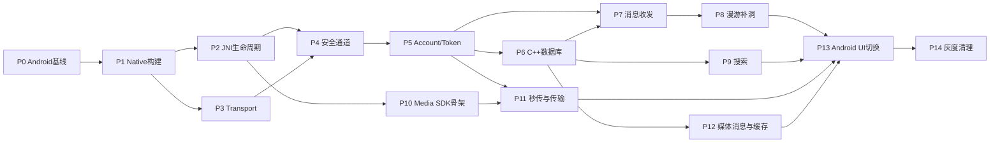

# 即通 QQNT 式薄 UI + 厚内核——可执行任务规划

> 来源：`outputs/jitong-qqnt-thin-ui-thick-kernel-plan-v3.md`
> 执行原则：以当前 Android 行为为兼容基线；每一阶段通过验收门禁后才能切换下一条真实业务链路；禁止新旧核心同时连接或同时写同一份业务数据。

## 0. 使用方法

每个任务统一按下面的闭环执行：

```text
Plan → Implement → Unit Test → Integration Test → Review → Fix → Verify → Commit
```

任务状态：

- `[ ]` 未开始
- `[-]` 执行中
- `[x]` 已完成并通过验收
- `[!]` 阻塞，必须记录原因

完成任务时必须在任务下面补充：

```text
完成提交：<commit>
验证命令：<commands>
验证结果：<result>
遗留问题：<issues or none>
```

## 1. 全局约束

以下规则适用于全部任务：

1. 不删除或覆盖当前 Kotlin 实现，直到 Native Kernel 灰度验收完成。
2. `KernelBackend` 在进程启动前确定，进程运行期间不可热切换。
3. 一个进程只允许一个长连接实现处于活动状态。
4. 一个账号同一时刻只能有一个消息数据库事实源。
5. C++ 网络线程禁止执行数据库写入、图片编码和大文件摘要计算。
6. JNI 回调只复制数据并投递事件，不执行 Kotlin 业务。
7. Token、密码、中间密钥不得写入日志。
8. 所有协议新增字段遵循 protobuf 兼容规则：不修改已使用字段号，不复用删除字段号。
9. 每次迁移必须以当前 Android 行为作为 Golden Test 对照。
10. 构建、单测和关键集成测试失败时禁止进入下一阶段。

## 2. 目标目录

```text
client_core/
├── include/client_core/
│   ├── JitongSdk.h
│   ├── Models.h
│   ├── Events.h
│   └── PlatformServices.h
├── src/
│   ├── sdk/
│   ├── account/
│   ├── transport/
│   ├── message/
│   ├── storage/
│   ├── search/
│   └── media/
└── tests/
    ├── unit/
    ├── integration/
    └── golden/

jitong_android/app/src/main/
├── cpp/
│   ├── CMakeLists.txt
│   ├── im_core_jni.cpp
│   ├── native_sdk_handle.h
│   ├── jni_observer.cpp
│   └── android_platform_services.cpp
└── java/com/jitong/im/core/
    ├── JitongSdk.kt
    ├── NativeBindings.kt
    ├── NativeEventSink.kt
    ├── KernelBackend.kt
    └── platform/
        ├── AndroidKeystoreProvider.kt
        ├── AndroidFileProvider.kt
        ├── AndroidImagePlatform.kt
        ├── AndroidSecureKv.kt
        └── AndroidNetworkObserver.kt
```

## 3. 依赖关系



可并行组：

- P2 JNI 生命周期与 P3 Transport 可并行。
- P9 搜索与 P10/P11 Media SDK 可并行。
- 单元测试与当前模块实现同步进行，不允许最后集中补测试。

---

# P0：冻结 Android 行为基线

## P0-T01 建立基线测试目录

- [ ] 创建 `client_core/tests/golden/`。
- [ ] 创建 `jitong_android/app/src/androidTest/` 对应测试目录。
- [ ] 创建 `outputs/kernel-baseline/` 保存非敏感测试结果。
- [ ] 编写 `BASELINE.md`，声明测试账号、环境、服务端版本和数据清理方法。

验收：

- 测试目录可被 CMake/Gradle 发现。
- 不提交密码、Token、私钥、真实手机号。

## P0-T02 固化登录基线

参考文件：

- `jitong_android/app/src/main/java/com/jitong/im/net/ImClient.kt`
- `jitong_android/app/src/main/java/com/jitong/im/net/SecureChannel.kt`
- `jitong_android/app/src/main/java/com/jitong/im/ui/AuthCoordinator.kt`
- `jitong_android/app/src/main/java/com/jitong/im/ui/MainViewModel.kt`

任务：

- [ ] 记录密码登录请求/响应字段，不记录字段值。
- [ ] 记录 Token Login 分支条件。
- [ ] 记录 Refresh 分支、Single-Flight 和 requestId 复用行为。
- [ ] 覆盖密码错误、Token 过期、Refresh 过期、被踢下线。
- [ ] 覆盖连续点击登录只产生一个认证任务。

验收：

- 每种场景有输入、状态变化、协议类型和最终结果。
- 可以据此判断 Native 行为是否与 Android 一致。

## P0-T03 固化消息和漫游基线

- [ ] 记录发送消息从 `SENDING → SENT/FAILED` 的状态变化。
- [ ] 记录 `msg_id`、`conversation_seq` 和时间字段变化。
- [ ] 覆盖双方同时发送。
- [ ] 覆盖重复包、断线重发、离线消息、历史分页和 seq 缺口。
- [ ] 导出不含敏感正文的结构化 Golden Case。

验收：同一组输入可以在 Kotlin Legacy 和 Native Kernel 上重复执行。

## P0-T04 固化搜索基线

参考文件：

- `data/ChatStore.kt`
- `data/db/Daos.kt`
- `util/PinyinIndex.kt`
- `ui/SearchHighlight.kt`

- [ ] 建立中文、全拼、首字母、拼音前缀、LIKE 子串用例。
- [ ] 加入“你/ni/n”“正/zheng/z”等容易混淆的案例。
- [ ] 保存期望命中 msgId 和汉字高亮区间。

验收：至少 50 个固定搜索用例全部可重复执行。

## P0-T05 固化媒体基线

参考文件：

- `net/HttpMediaClient.kt`
- `util/ImageCodec.kt`
- `ui/MainViewModel.kt`
- `ui/ChatScreen.kt`

- [ ] 覆盖普通图、横长图、竖长图。
- [ ] 覆盖 JPEG、PNG、HEIC、Display P3、EXIF 旋转。
- [ ] 记录三档资源尺寸、摘要、Content-Type 和显示优先级。
- [ ] 覆盖秒传命中、未命中、PoP 失败、下载 404。
- [ ] 保存测试图片的像素摘要或感知哈希，验证颜色没有倒退。

### P0 门禁

- [ ] P0-T01～P0-T05 全部完成。
- [ ] Golden 数据不包含秘密。
- [ ] 当前 Android Debug 构建通过。

---

# P1：打通 Android Native 构建

## P1-T01 CMake 组件化

修改：

- `client_core/CMakeLists.txt`
- `protocol/CMakeLists.txt`

任务：

- [ ] 增加 `CLIENT_CORE_WITH_SQLITE`。
- [ ] 增加 `CLIENT_CORE_WITH_MEDIA`。
- [ ] Android 构建关闭 tests/tools。
- [ ] 宿主机 `protoc` 与 Android 目标 `libprotobuf` 分离。
- [ ] 所有进入共享库的静态库启用 PIC。
- [ ] 保持桌面端原构建路径可用。

验收命令：

```bash
cmake -S client_core -B build/client-core-desktop
cmake --build build/client-core-desktop
ctest --test-dir build/client-core-desktop --output-on-failure
```

## P1-T02 Android externalNativeBuild

修改：

- `jitong_android/app/build.gradle.kts`
- 新建 `jitong_android/app/src/main/cpp/CMakeLists.txt`

任务：

- [ ] 配置 NDK/CMake。
- [ ] 配置 `arm64-v8a` 和 `x86_64`。
- [ ] 接入 OpenSSL Android 目标库。
- [ ] 接入 protobuf C++ Android 运行库。
- [ ] 首阶段关闭 SQLite 和 Media。

验收：两个 ABI 都生成 `libjitong_kernel.so`。

## P1-T03 Native Self Test

新建：

- `im_core_jni.cpp`
- `NativeBindings.kt`

实现：

```text
nativeVersion()
nativeSelfTest()
```

验收：真机和 x86_64 模拟器均返回相同核心版本和 protobuf/OpenSSL 自检结果。

### P1 门禁

- [ ] Desktop C++ 构建没有回归。
- [ ] Android 两个 ABI 构建通过。
- [ ] `.so` 可加载并完成 Self Test。

---

# P2：JNI 生命周期与平台接口

## P2-T01 NativeSdkHandle

新建：

- `native_sdk_handle.h/.cpp`

任务：

- [ ] `jlong` 指向 `NativeSdkHandle`，禁止指向裸 `ClientCore*`。
- [ ] 每次 API 调用在锁内取得 `shared_ptr<JitongSdk>`。
- [ ] `destroying` 后拒绝新调用。
- [ ] `nativeDestroy` 幂等。

## P2-T02 JniObserver

新建：

- `jni_observer.h/.cpp`
- `NativeEventSink.kt`

任务：

- [ ] 缓存 `JavaVM*`、类和 method ID。
- [ ] 正确 New/DeleteGlobalRef。
- [ ] 只在线程由 JNI 临时 Attach 时 Detach。
- [ ] 每次 CallVoidMethod 后检查并清理异常。
- [ ] 回调只入队，不做业务。

## P2-T03 平台原子能力接口

新建：

- `PlatformServices.h`
- `AndroidKeystoreProvider.kt`
- `AndroidFileProvider.kt`
- `AndroidImagePlatform.kt`
- `AndroidSecureKv.kt`
- `AndroidNetworkObserver.kt`

任务：

- [ ] 定义异步签名接口。
- [ ] 定义 URI/FileHandle 读取接口。
- [ ] 定义图片 probe/decode/encode 接口。
- [ ] 定义 opaque secure KV 接口。
- [ ] 所有接口禁止包含 Token、消息、秒传等业务语义。

## P2-T04 生命周期压力测试

- [ ] 创建/销毁 100 次。
- [ ] 回调并发销毁。
- [ ] 后台线程回调 Attach/Detach。
- [ ] 开启 CheckJNI。
- [ ] 使用 ASan 构建跑 UAF 检查。

### P2 门禁

- [ ] 无 UAF、double free、GlobalRef 泄漏。
- [ ] 所有异常转换成 SDK 错误，不能穿透 JNI。

---

# P3：Transport 和消息边界

## P3-T01 重构 TcpTransport 生命周期

修改：

- `client_core/src/TcpTransport.h`
- `client_core/src/TcpTransport.cpp`

任务：

- [ ] 每次 connect 创建新的 socket/TLS stream。
- [ ] 重连前 `io_context.restart()`。
- [ ] 重置 `m_notified/m_closing/writeQueue`。
- [ ] 明确 connect/close 状态机。
- [ ] 禁止工作线程 join 自身。
- [ ] 所有异步 handler 绑定安全生命周期 token。

## P3-T02 帧编解码独立模块

新建：

- `transport/FrameCodec.h/.cpp`

任务：

- [ ] 4B 大端包长编码解码。
- [ ] 4B 小端协议号编码解码。
- [ ] `0 < bodyLen <= MAX_PACK_LEN`。
- [ ] 精确读取 Header 后再精确读取 Body。
- [ ] 非法长度直接关闭连接。
- [ ] 未知协议号可记录并忽略，越界不能访问函数表。

## P3-T03 单写发送队列

- [ ] 所有发送都 post 到 asio executor。
- [ ] 同一时刻只有一个 `async_write`。
- [ ] shutdown 明确处理队列中的未发送请求。
- [ ] 业务回调返回 `CANCELLED/DISCONNECTED`。

## P3-T04 Transport 测试

- [ ] 半包、粘包、1 字节分段。
- [ ] 0 长度、超大长度、错误端序。
- [ ] 连续重连 50 次。
- [ ] 服务端中途关闭。
- [ ] 发送过程中 close。

### P3 门禁

- [ ] 无消息边界错位。
- [ ] 错误包长后可安全断线并新建会话。
- [ ] 重连 50 次无资源增长。

---

# P4：TLS 与应用层安全通道

## P4-T01 TLS 客户端配置

- [ ] TLS 最低版本 1.3。
- [ ] 验证证书链和域名。
- [ ] 设置正确 SNI。
- [ ] 实现 SPKI Pinning。
- [ ] 禁止 `verify_none` 和永久返回 true 的 callback。

## P4-T02 ClientSecureChannel

新建：

- `transport/ClientSecureChannel.h/.cpp`

对齐 `SecureChannel.kt`：

- [ ] X25519 临时密钥。
- [ ] Ed25519 服务端身份签名验证。
- [ ] transcript hash。
- [ ] HKDF-SHA256 派生双向密钥、nonce 和 Finished key。
- [ ] AES-256-GCM。
- [ ] sessionId/sequence/protocol 进入 AAD。
- [ ] 收发 sequence 分离且单调递增。
- [ ] 中间密钥安全清除。

## P4-T03 安全负向测试

- [ ] 错误证书。
- [ ] 错误 SPKI。
- [ ] 错误服务端签名。
- [ ] 修改密文/tag/AAD。
- [ ] 重放 sequence。
- [ ] Finished 不一致。

### P4 门禁

- [ ] 与 Android Golden 握手字段和方向完全一致。
- [ ] 抓包不可看到业务明文。
- [ ] 任意认证失败都不会继续解析业务包。

---

# P5：AccountSession、Token 与防重入

## P5-T01 AuthStateMachine

新建：

- `account/AuthStateMachine.h/.cpp`
- `account/AccountSession.h/.cpp`

状态：

```text
Stopped → Connecting → Handshaking → Authenticating → Authenticated
                    ↘ Backoff → Reconnecting
```

任务：

- [ ] 相同登录请求复用 RequestId。
- [ ] 不同账号并发登录返回 `AUTH_OPERATION_IN_PROGRESS`。
- [ ] UI 按钮禁用不作为正确性保证。
- [ ] 被踢后禁止自动重连。

## P5-T02 DeviceProofService

- [ ] C++ 构造 canonical proof。
- [ ] requestId 关联异步签名结果。
- [ ] 超时/取消后丢弃迟到签名。
- [ ] 平台层只执行 P-256 sign。

## P5-T03 TokenManager

新建：

- `account/TokenManager.h/.cpp`
- `account/TokenStore.h/.cpp`

任务：

- [ ] C++ 解析和保存完整 TokenSession。
- [ ] 启动时自动判断 Access/Refresh 有效期。
- [ ] 实现 Refresh Single-Flight。
- [ ] 持久化 pending requestId。
- [ ] 刷新成功原子轮换 Token。
- [ ] Token reuse 清理 Token family。
- [ ] 等待 Token 的 Socket/HTTP 请求统一恢复或失败。

## P5-T04 自动登录入口

UI 只调用 `sdk.start()`：

- [ ] 无凭证上报 `NeedLogin`。
- [ ] Access 有效自动 Token Login。
- [ ] Access 临期、Refresh 有效自动刷新后登录。
- [ ] Refresh 过期清理并上报 `NeedLogin`。

## P5-T05 认证测试

- [ ] 密码登录成功/失败。
- [ ] Token 登录成功/过期。
- [ ] Refresh 成功/过期/重用。
- [ ] 10 个并发请求触发一次刷新。
- [ ] 刷新途中断线，重连沿用 requestId。
- [ ] 连点登录只发一条认证链路。

### P5 门禁

- [ ] Kotlin UI/ViewModel 不包含 Token 分支和刷新逻辑。
- [ ] Native 自动登录行为通过 Android Golden 对照。

---

# P6：C++ SQLCipher 数据层

## P6-T01 SQLCipher Android 构建

- [ ] 将 SQLCipher C/C++ 库接入 Native 构建。
- [ ] 验证普通 SQLite 无法读取加密数据库。
- [ ] 每账号独立数据库路径。
- [ ] DB key 由 C++ 管理并通过平台安全存储包装。

## P6-T02 Schema 与 Migration

新建：

- `storage/Schema.sql` 或版本化 migration 文件。

表：

- [ ] messages
- [ ] conversations
- [ ] friends
- [ ] message_fts
- [ ] sync_watermarks
- [ ] outbox
- [ ] media_records
- [ ] transfer_tasks

关键约束：

- [ ] `UNIQUE(owner_id,msg_id)`。
- [ ] `(owner_id,peer_id,conversation_seq)`。
- [ ] `(owner_id,peer_id,server_time)`。
- [ ] `(owner_id,status,local_order)`。

## P6-T03 单写线程和只读连接池

- [ ] `DbCommandQueue`。
- [ ] 单个 Writer connection/thread。
- [ ] 查询使用只读连接。
- [ ] 写事务完成后触发 Query invalidation。
- [ ] 网络线程只投递命令，不同步等待磁盘。

## P6-T04 Room 数据迁移器

- [ ] Android 只读分页导出旧数据。
- [ ] C++ 按 msg_id 幂等导入。
- [ ] 重建 FTS。
- [ ] 比对消息数、会话数、max_seq 和抽样摘要。
- [ ] 原子写 `migration_completed`。
- [ ] 中断后可重新执行。

### P6 门禁

- [ ] 数据库加密验证通过。
- [ ] 迁移可中断恢复。
- [ ] 网络线程不执行 SQL。
- [ ] 旧 Room 数据数量与 Native 数据一致。

---

# P7：消息 Outbox / Inbox

## P7-T01 完整消息模型

- [ ] 定义 `MessageId/ConversationId/ConversationSeq` 强类型。
- [ ] 保留 sender/receiver/peer/type/content/time/status。
- [ ] 媒体元数据进入统一 Message 模型。
- [ ] JNI 只输出稳定 DTO/protobuf。

## P7-T02 Outbox

- [ ] 内核生成 msg_id。
- [ ] 先持久化 SENDING。
- [ ] 认证可用后发送。
- [ ] 超时重试使用同一 msg_id。
- [ ] ACK 回填同一行的 seq/time/status。
- [ ] kill 进程后恢复未完成任务。

## P7-T03 Inbox

- [ ] 实时、离线、漫游共用一个入口。
- [ ] `owner_id + msg_id` 幂等。
- [ ] 单事务更新消息、会话和搜索索引。
- [ ] 重复消息不重复通知 UI。

## P7-T04 Query Subscription

- [ ] `observeConversations()`。
- [ ] `observeMessages(conversationId)`。
- [ ] 增量失效通知。
- [ ] JNI/Kotlin 订阅销毁后停止回调。

### P7 门禁

- [ ] 双方同时发送最终 seq 顺序一致。
- [ ] 重发和重复包不产生第二条消息。
- [ ] UI 消息列表只来自 Native Query。

---

# P8：漫游、离线和补洞

## P8-T01 SyncWatermark

- [ ] 持久化每会话 local_max_seq。
- [ ] 保存同步状态和分页 cursor。
- [ ] 重启后恢复未完成同步。

## P8-T02 会话摘要同步

- [ ] 认证成功后自动拉取。
- [ ] 与本地水位比较。
- [ ] 发现缺口创建补洞任务。

## P8-T03 历史分页

- [ ] UI 上报滚动到顶部，不传 beforeSeq。
- [ ] SyncEngine 从数据库读取当前 minSeq。
- [ ] 处理 hasMore/minSeq。
- [ ] 防止相同分页并发。

## P8-T04 补洞测试

- [ ] 缺 1 条、连续多条、页边界缺失。
- [ ] 同步期间收到实时消息。
- [ ] 同步期间断网和进程退出。
- [ ] 服务端重复返回同一页。

### P8 门禁

- [ ] 实时/离线/漫游不重不漏。
- [ ] UI 不计算 beforeSeq 和 seq 缺口。

---

# P9：C++ FTS4、拼音搜索和高亮

## P9-T01 选择并封装 C++ 拼音实现

- [ ] 评估体积、许可证、多音字、Android/桌面支持。
- [ ] 封装为 `IPinyinConverter`，禁止业务依赖第三方 API。
- [ ] 用 P0 Golden Case 验证与 Android 当前结果兼容。

决策门槛：若没有可兼容库，先将当前拼音映射表生成为 C++ 只读数据，不允许改变搜索语义后直接切换。

## P9-T02 入库索引

- [ ] 正文生成 normalized/pinyin/initials。
- [ ] messages 与 FTS4 同事务写入。
- [ ] 历史消息可分批重建。

## P9-T03 查询引擎

- [ ] 中文/普通文本查询。
- [ ] 拼音前缀查询。
- [ ] 首字母查询。
- [ ] LIKE 子串补充。
- [ ] msg_id 去重和游标分页。

## P9-T04 高亮映射

- [ ] 建立拼音 token 到汉字下标映射。
- [ ] 返回 UTF-16 或 Unicode code point 明确语义的区间。
- [ ] Kotlin 只按区间加粗。

### P9 门禁

- [ ] P0 的至少 50 个 Golden 搜索用例全部通过。
- [ ] “n”不会错误匹配“正/真”，但能按产品规则匹配“你”。

---

# P10：Media SDK 骨架与图片流水线

## P10-T01 Media 公共 API

- [ ] `sendImage/sendFile/openImage/cancelTransfer/setVisibleMessages`。
- [ ] `TransferState/ImageDisplayState`。
- [ ] UI API 不暴露缩略图等级选择和 HTTP URL。

## P10-T02 Android File/Image 平台适配

- [ ] Content URI → FileHandle/fd。
- [ ] probe 宽高、EXIF、色彩空间。
- [ ] decode 到明确像素格式。
- [ ] 转换到 sRGB。
- [ ] AVIF 编码。
- [ ] 临时文件和原子 rename。

## P10-T03 ThumbnailPipeline

- [ ] 普通图片完整等比缩放。
- [ ] 横向超长图居中裁剪缩略图。
- [ ] 纵向超长图展示顶部首屏。
- [ ] 原图不裁剪。
- [ ] 生成小图、大图、原图三档元数据。
- [ ] 原始宽高进入 MediaCard。

## P10-T04 色彩与像素测试

- [ ] Display P3 → sRGB。
- [ ] HEIC/HDR 输入。
- [ ] EXIF 90/180/270。
- [ ] 对比 Android 基线像素或感知哈希。

### P10 门禁

- [ ] 不再出现粉色/绿色滤镜。
- [ ] 长图缩略图符合基线。
- [ ] UI 无图片处理决策。

---

# P11：秒传、分片、下载和取消

## P11-T01 StreamingHash

- [ ] 64 KiB 或配置化缓冲流式 SHA-256。
- [ ] 支持进度和取消。
- [ ] 不把大文件整体加载内存。

## P11-T02 InstantUploadClient / PoP

- [ ] 提交 sha256/size/contentType/receiverId。
- [ ] 校验 challenge offset/length 不越界。
- [ ] 从同一文件身份读取指定片段。
- [ ] `SHA-256(nonce || chunk)`。
- [ ] 服务端授权完成后再返回成功。
- [ ] 文件在计算期间改变时拒绝秒传。

## P11-T03 ChunkUploader

- [ ] upload_id 与 checkpoint。
- [ ] chunk hash。
- [ ] 并发窗口和带宽限制。
- [ ] 指数退避。
- [ ] 网络恢复续传。
- [ ] 完整摘要校验。

## P11-T04 RangeDownloader

- [ ] `.download` 临时文件。
- [ ] HTTP Range。
- [ ] ETag/文件摘要防止错误续传。
- [ ] 完成后摘要校验和原子 rename。
- [ ] 失败删除或保留可恢复 checkpoint。

## P11-T05 任务生命周期

- [ ] TransferTask 由 `shared_ptr` 管理。
- [ ] 回调捕获 `weak_ptr`。
- [ ] 回主执行器前 `lock()`。
- [ ] cancel 后不再上报 Completed。
- [ ] SDK destroy 等待任务安全停止。

### P11 门禁

- [ ] 秒传命中不上传整文件。
- [ ] 1 GiB 测试文件内存占用保持有界。
- [ ] 中断续传成功。
- [ ] 取消/销毁压力测试无 UAF。

---

# P12：媒体消息、缓存和分级加载

## P12-T01 MediaRecord

- [ ] 保存 original/small/large 的 fileId、sha256、path 和状态。
- [ ] 消息数据库与媒体记录保持事务关联。
- [ ] 服务端 404 区分失效索引和临时网络错误。

## P12-T02 MediaCard

- [ ] 上传成功和授权完成后发送 MediaCard。
- [ ] 携带原始宽高、三档索引、Content-Type、size、sha256。
- [ ] 接收、离线和漫游使用同一个解析入口。

## P12-T03 DownloadScheduler

- [ ] `file_id + variant` 单飞。
- [ ] P0～P4 优先级队列。
- [ ] UI 可见消息只作为输入信号。
- [ ] 点击原图抢占低优先级后台预取。

## P12-T04 ImageDisplayState

- [ ] OriginalReady。
- [ ] LargeThumbnailReady + 原图下载中。
- [ ] SmallThumbnailReady + 升级中。
- [ ] Placeholder(width,height)。
- [ ] Failed(retryable)。

### P12 门禁

- [ ] UI 只渲染当前最佳资源。
- [ ] 图片升级时气泡尺寸不变化。
- [ ] 点击优先显示本地最高质量并请求原图。

---

# P13：Android UI 切换

## P13-T01 KernelBackend

新建：

- `KernelBackend.kt`
- `JitongSdk.kt`

- [ ] 启动时确定 Legacy/Native。
- [ ] 进程内不可修改。
- [ ] 确保只创建一个连接核心。

## P13-T02 LoginScreen/MainViewModel

- [ ] 登录页只调用 `sdk.login()`。
- [ ] 启动只调用 `sdk.start()`。
- [ ] 删除 Native 路径中的 Token 判断、refresh 和 reconnect 编排。
- [ ] UI 只映射 `AccountState/ConnectionState`。

## P13-T03 Conversation/Chat

- [ ] 会话和消息只订阅 Native Query。
- [ ] sendText/sendImage/sendFile 只调用 SDK。
- [ ] UI 不直接写 Room。
- [ ] UI 不解析 protobuf。

## P13-T04 Search

- [ ] 查询交给 SDK。
- [ ] 直接使用内核返回 highlightRanges。
- [ ] UI 只绘制加粗区间。

## P13-T05 Image UI

- [ ] 上报 visible message IDs。
- [ ] 点击调用 `sdk.openImage(msgId)`。
- [ ] 根据 ImageDisplayState 渲染。
- [ ] 保持 width/height 等比占位。

### P13 门禁

- [ ] Native 模式下 ViewModel 不含业务状态机。
- [ ] P0 所有 Android Golden Case 通过。

---

# P14：灰度、性能和清理

## P14-T01 指标

- [ ] 登录成功率和时延。
- [ ] Token 刷新成功率。
- [ ] 消息发送成功率、重复率、缺失率。
- [ ] 重连次数和恢复时延。
- [ ] 数据库写入/查询耗时。
- [ ] 搜索耗时。
- [ ] 秒传命中率和节省字节。
- [ ] 缩略图/原图下载流量。
- [ ] Native 崩溃、ANR、内存和线程数。

## P14-T02 灰度顺序

- [ ] 开发者开关。
- [ ] 内部测试账号。
- [ ] 小比例设备。
- [ ] 扩大比例。
- [ ] Native 默认开启。

任一核心指标显著劣化时停止扩大并回退到 Legacy 重启。

## P14-T03 删除旧实现

只有所有门禁通过后才允许：

- [ ] 删除 Kotlin `ImClient` 协议实现。
- [ ] 删除 Kotlin `SecureChannel/AppCrypto` 业务路径。
- [ ] 删除 ViewModel Token 刷新代码。
- [ ] 删除 ViewModel 媒体上传下载编排。
- [ ] 将旧 Room 数据库改为只迁移工具或移除。
- [ ] 更新 README、架构图和答辩材料。

### P14 最终门禁

- [ ] 所有 P0 Golden Case 通过。
- [ ] Native 核心至少完成一轮真实灰度。
- [ ] 无已知 P0/P1 崩溃、UAF、丢消息和数据损坏问题。
- [ ] Android 与桌面端实际复用同一 C++ 业务模块。

---

## 19. 每次提交建议

建议按任务提交，不要按阶段积累成超大提交：

```text
build(native): add Android core shared library
feat(jni): add safe NativeSdkHandle lifecycle
refactor(transport): make TLS transport reconnectable
feat(security): add client application secure channel
feat(auth): move token lifecycle into native AccountSession
feat(storage): add SQLCipher message store and DB writer
feat(message): add persistent outbox and idempotent inbox
feat(sync): add roam pagination and seq gap recovery
feat(search): add native FTS4 pinyin search and highlights
feat(media): add thumbnail pipeline and Android image adapter
feat(transfer): add PoP instant upload and resumable chunks
feat(android): switch UI to JitongSdk native backend
chore(legacy): remove duplicated Kotlin protocol stack
```

## 20. 执行前必须确认的技术决策

这些决策必须在对应阶段开始前形成 ADR，不能边写边猜：

- [ ] ADR-001：C++ protobuf Android runtime 的来源和版本策略。
- [ ] ADR-002：OpenSSL/SQLCipher/libavif 的构建与升级策略。
- [ ] ADR-003：C++ 拼音库选择及许可证。
- [ ] ADR-004：数据库密钥生成、包装、恢复和登出销毁。
- [ ] ADR-005：JNI DTO 使用 protobuf envelope 还是稳定手写 DTO。
- [ ] ADR-006：媒体文件通过临时路径还是 fd 交给 C++。
- [ ] ADR-007：Token SecureString 和内存清理边界。
- [ ] ADR-008：Legacy Room 到 Native SQLCipher 的迁移和回退策略。
- [ ] ADR-009：后台保活、Android 网络变化与系统限制的边界。
- [ ] ADR-010：缩略图规格、长图阈值和 AVIF 质量参数。

## 21. 第一轮建议执行范围

第一轮只执行到 P2，不立即迁移真实登录：

```text
P0 Android基线
→ P1 Native构建
→ P2 JNI生命周期和平台接口
```

第一轮交付物：

- Android 行为 Golden Case；
- 两个 ABI 的 `libjitong_kernel.so`；
- 可安全创建销毁的 Native SDK；
- 平台原子能力接口；
- CheckJNI/ASan 验证结果；
- 不影响当前 Kotlin 客户端的关闭状态 Native 开关。

完成上述范围后，再开始 P3/P4 网络与安全通道迁移。

## 22. 第二轮工作与验收范围：P3 Transport + P4 安全通道

> 第二轮目标不是迁移登录、Token、数据库、消息或媒体业务，而是先建立一个可重连、
> 边界明确、默认安全的 C++ 网络底座。完成后，旧 `test_e2e` 必须能越过当前
> `WAIT_CLIENT_HELLO` 阻断，证明 C++ ClientCore 与服务端完成同一套安全握手。

### 22.1 起点与范围边界

#### 22.1.1 已具备的前置条件

- Android `libjitong_kernel.so` 已能构建、加载、创建和安全销毁。
- Native 事件桥、句柄表、CheckJNI、宿主机 ASan/UBSan 和 Android HWASan 已通过。
- 服务端已经强制执行 TLS 后的应用层安全握手，并坚持 fail-close。
- `security_e2e` 已证明：TLS 成功后直接发送 Login(1000)，服务端会因等待
  AppClientHello(1036) 而断开，业务明文不会进入 AuthHandler。
- `im.proto` 已定义 AppClientHello、AppServerHello、AppFinished 和
  AppEncryptedFrame；服务端已有可对照的 `AppCrypto` 与 `Session` 实现。

#### 22.1.2 本轮纳入

1. P3：Transport 生命周期、FrameCodec、单写队列和消息边界测试。
2. P4：TLS 1.3、证书/域名/SNI/SPKI、C++ ClientSecureChannel 和安全负向测试。
3. 恢复服务端完整 `test_e2e`，至少跑通注册、登录、在线/离线文本、互踢、漫游、
   HTTP 图片上传/授权下载。
4. Android arm64 接入同一 Transport/SecureChannel，完成最小连接和握手验证。
5. 普通测试、CheckJNI、ASan/UBSan、Android HWASan 回归。

#### 22.1.3 本轮不纳入

- P5 登录状态机、Token 自动刷新与登录 Single-Flight。
- P6 C++ SQLCipher 数据库迁移。
- P7/P8 Outbox、消息落库、漫游补洞和多设备同步内核化。
- P9 搜索迁入 C++。
- P10～P12 图片缩略图、秒传、分片和下载调度内核化。
- x86_64 模拟器实跑（按本轮决定延期；仍要求 x86_64 编译通过）。
- AVIF 偏色修复不属于 P3/P4，但 Media Golden 必须继续保留失败记录，不能删除或放宽。

### 22.2 P3 工作与验收：Transport 和消息边界

#### 22.2.1 P3-T01 TcpTransport 生命周期

实现要求：

- 每次 `connect()` 创建新的 resolver、socket 和 TLS stream，不复用已关闭对象。
- 重连前调用 `io_context.restart()`，并清空上一个连接的解析、读写和计时状态。
- 明确状态机：`Idle → Resolving → Connecting → TlsHandshaking → Connected → Closing → Closed`。
- `connect()`、`close()`、远端断开和握手失败最终只能产生一次关闭通知。
- 使用 connection generation/lifetime token；旧连接迟到 handler 不得操作新连接。
- 禁止 IO 工作线程 join 自身；析构必须有确定的停止和 join 顺序。
- 连接失败后可以在同一个 `TcpTransport` 实例上安全重试。

验收用例：

- DNS/连接失败后重连成功。
- TLS 握手中主动关闭。
- 服务端在 Header、Body 和写入过程中分别关闭。
- 连续连接—断开 50 次，线程数、句柄数和回调次数不持续增长。
- 旧连接回调迟到时不污染新连接状态。

#### 22.2.2 P3-T02 FrameCodec

线格式必须保持现有兼容约定：

```text
[4B 大端 body_len = 4 + payload_size]
[4B 小端 protocol_type]
[protobuf payload]
```

实现要求：

- 从 `TcpTransport` 中抽出唯一的 `FrameCodec`，禁止测试和生产各复制一套端序逻辑。
- Header 固定精确读取 4 字节；解析并校验 body_len 后，再精确读取 Body。
- 合法范围为 `4 <= body_len <= 10 MiB`；body_len 小于协议号或超过上限立即 fail-close。
- payload 长度使用安全减法，所有长度转换先检查再转换，禁止整数溢出和超大分配。
- protocol_type 解码为小端 `uint32_t`；分发前检查范围，未知号记录后忽略或上报，
  绝不能直接越界访问函数表。
- 包长损坏后不尝试在密文字节流中扫描“下一个包头”；关闭本次连接，由上层建立新会话。

验收矩阵：

| 场景 | 预期 |
|---|---|
| Header 每次只到 1 字节 | 聚合到 4 字节后才解析 |
| Body 每次只到 1～7 字节 | 精确聚合到 body_len 后只回调一次 |
| 两帧一次到达（粘包） | 连续解析两帧，不串包 |
| Header 与半个 Body 同时到达 | 保存已有字节并补齐剩余部分 |
| body_len=0/1/2/3 | 立即断线，不分配 Body |
| body_len=10 MiB | 按边界规则接受 |
| body_len>10 MiB | 立即断线 |
| 把包长误写为小端 | 按非法超长处理并断线 |
| protocol_type 未注册 | 不访问越界函数指针 |
| 截断 protobuf | 解析失败只丢弃本包或关闭连接，不崩溃 |

#### 22.2.3 P3-T03 单写发送队列

实现要求：

- 所有发送统一 `post` 到同一个 Asio executor/strand。
- 队列从空变为非空时只启动一次 `async_write`，完成后再发送下一项。
- 同一 TLS stream 任意时刻最多一个写操作，不允许多线程直接并发 `async_write`。
- 每个待发送项拥有完整不可变 buffer，异步完成前内存保持有效。
- close 后拒绝新发送；队列中未开始/未完成项统一返回 `CANCELLED` 或 `DISCONNECTED`。
- 写失败触发一次连接关闭，剩余队列逐项完成失败，不能永远悬挂。

验收用例：

- 8 个线程并发提交至少 10,000 个小帧，服务端解帧数量、内容和边界全部正确。
- 大帧写入过程中追加小帧，顺序与入队顺序一致。
- 写入过程中 close，所有请求都有且仅有一次结果。
- ThreadSanitizer 可运行的平台执行发送队列并发测试；不可运行时至少使用压力测试 + ASan/UBSan。

#### 22.2.4 P3-T04 P3 门禁

- [ ] `FrameCodec` 单元测试覆盖上述全部边界。
- [ ] 真实 loopback TLS 测试覆盖半包、粘包、1 字节分段和中途断开。
- [ ] 连续重连 50 次成功，关闭通知不重复，无线程/句柄持续增长。
- [ ] 单写队列并发压力通过，无交叉写导致的 TLS record/业务帧损坏。
- [ ] 错误包长后安全断线，并可建立全新连接恢复。
- [ ] `client_core` 普通 CTest 与 ASan/UBSan 全绿。
- [ ] Android arm64 Native 生命周期、CheckJNI、HWASan 回归不退化。

### 22.3 P4 工作与验收：TLS 与应用层安全通道

#### 22.3.1 P4-T01 TLS 客户端安全配置

实现要求：

- TLS 最低和最高策略明确；本项目验收要求协商结果为 TLS 1.3。
- 必须验证证书链、有效期和主机名，SNI 使用逻辑服务域名 `im.example.com`，
  即使 TCP 实际连接 `127.0.0.1` 也不能用 IP 替代身份名。
- 在正常证书验证之后执行 SPKI SHA-256 Pinning；证书轮换至少支持 current/next 两个 pin。
- 禁止 `verify_none`、永久返回 true 的 verify callback，以及仅在日志中提示但继续连接。
- CA 文件缺失、证书错误、域名错误和 pin 错误必须在进入应用握手前失败。

负向用例：

- 自签但不受信证书、过期证书、错误 SAN、错误 SNI、错误 SPKI、空 pin 集。
- 证书链正确且 current pin 命中；证书轮换时 next pin 命中。
- 验证失败后不得发送 AppClientHello 或任何业务帧。

#### 22.3.2 P4-T02 ClientSecureChannel 四步握手

必须对齐 Android `SecureChannel.kt` 和服务端 `Session.cpp` 的字段、字节序及 transcript：

```text
C++ Client                         Server Session
    |-- AppClientHello ----------->| version / X25519 pub / nonce / randomId / suite
    |<-- AppServerHello ------------| server pub / nonce / sessionId / keyId / Ed25519 signature
    |-- AppFinished --------------->| client verify_data
    |<-- AppFinished ---------------| server verify_data
    |==== AppEncryptedFrame ========| 双向业务密文，sequence 分方向递增
```

实现要求：

- 每次连接生成新的 X25519 临时密钥、32 字节 client_nonce 和 16 字节 random_id。
- 严格校验 version、cipher_suite、各字段长度和服务端 key_id。
- 使用内置受信 Ed25519 公钥验证 AppServerHello 签名；未知 key_id fail-close。
- transcript 的 label、长度前缀、字段顺序和大端整数与服务端完全一致。
- X25519 共享秘密全零必须拒绝。
- HKDF-SHA256 一次派生 C→S/S→C key、nonce prefix、Finished key，方向不能混用。
- Finished 使用 transcript hash 计算并常量时间比较；验证完成前禁止业务发送。
- AES-256-GCM 的 AAD 必须绑定 version、session_id、sequence；协议号放进密文正文。
- 收发 sequence 分离，从 1 开始严格 `expected+1`；重复、跳号、回退和溢出均断线。
- tag 固定 16 字节；认证失败时不得把任何明文交给业务分发。
- 私钥、共享秘密、派生密钥和临时明文在离开作用域时安全清零。
- 重连必须生成新 session_id/密钥/nonce，旧会话密文在新连接上不可重放。

#### 22.3.3 P4-T03 安全负向测试

| 攻击/故障 | 预期 |
|---|---|
| ServerHello 签名翻转 1 bit | 握手失败，无业务包 |
| server nonce/pubkey/sessionId 长度错误 | 握手失败 |
| Finished verify_data 错误 | 握手失败 |
| 密文、tag、AAD 任意翻转 1 bit | GCM 认证失败并断线 |
| 重放上一帧 sequence | 拒绝重放并断线 |
| sequence 跳号或回退 | 拒绝并断线 |
| 把 S→C 密文送入 C→S 方向 | 因方向密钥不同认证失败 |
| 旧连接密文注入新连接 | 因 sessionId/密钥不同失败 |
| 安全通道建立后发送明文 Login | 服务端 fail-close（现有 security_e2e） |
| 握手超时 | 15 秒内关闭，释放全部状态 |

#### 22.3.4 Android/C++ 一致性 Golden

使用固定的测试私钥、nonce、random_id 和 ServerHello，Android 与 C++ 必须输出完全一致的：

- signing transcript 字节及 SHA-256；
- X25519 shared secret；
- HKDF 派生的双向 key、nonce prefix、Finished key；
- client/server Finished verify_data；
- sequence=1 的 AAD、nonce、ciphertext 和 tag。

Golden 文件中只放测试向量，禁止写入生产私钥、Token、手机号和真实 sessionId。

#### 22.3.5 P4 门禁

- [ ] TLS 1.3、证书链、域名、SNI 和双 pin 全部通过；所有负向证书用例 fail-close。
- [ ] Android/C++/Server 三端安全向量逐字节一致。
- [ ] P4 全部篡改、重放、方向混淆和握手超时用例通过。
- [ ] 抓取 loopback 流量，只能看到 TLS records，测试关键词和 protobuf 业务正文不可见。
- [ ] `security_e2e` 继续通过，证明服务端没有为了兼容 C++ 而允许降级。
- [ ] 删除旧 `test_e2e` 的 `DISABLED`，完整业务 e2e 通过。
- [ ] 完整业务 e2e 在 ASan+UBSan 下通过。
- [ ] Android arm64 最小流程达到：TLS → 应用握手完成 → 加密 Heartbeat/登录请求 → 正常解密响应。
- [ ] CheckJNI 与 HWASan 无新增错误。

### 22.4 完整业务 E2E 验收清单

恢复后的 `test_e2e` 至少必须覆盖：

1. TLS 1.3 + 应用层四步握手成功。
2. 注册成功，重复昵称/手机号返回确定错误。
3. 密码正确登录成功、错误密码失败，登录请求与响应均在 AppEncryptedFrame 内。
4. 两用户在线 C2C 文本转发，发送方 ACK、接收方消息内容正确。
5. 接收方离线时服务端转存，重连登录后补发。
6. 同账号新连接登录后旧连接收到 Kicked，旧连接停止发送业务。
7. 心跳至少持续三个周期，连接保持；心跳超时能关闭。
8. 漫游会话摘要、历史分页、beforeSeq/minSeq/hasMore 正确且无重复。
9. HTTP 图片上传成功，图片卡片只携带元数据和授权 fileId。
10. 消息参与者可下载且 SHA-256 一致，第三方持有 fileId 仍返回未授权。
11. 服务停止后所有 ClientCore/Session/HTTP worker 可确定退出，临时数据库和文件可清理。

测试隔离要求：

- 数据库、证书、身份密钥和上传目录只能使用测试生成物或 `/tmp` 临时目录。
- 禁止访问仓库中的 `data/im.db`、真实 uploads 和生产配置。
- 端口冲突不得被误报成业务失败；优先支持绑定端口 0 并回传系统分配端口。
- 每个断言必须有有界超时，失败时打印当前连接状态、最后协议号和安全状态。

### 22.5 第二轮交付物

预期代码：

```text
client_core/src/transport/FrameCodec.{h,cpp}
client_core/src/transport/ClientSecureChannel.{h,cpp}
client_core/src/TcpTransport.{h,cpp}              生命周期与单写队列重构
client_core/tests/test_frame_codec.cpp
client_core/tests/test_transport.cpp
client_core/tests/test_secure_channel.cpp
client_core/tests/golden/app-security-v1.json
im_server/tests/test_e2e.cpp                     移除 DISABLED，恢复完整链路
```

预期证据：

```text
outputs/kernel-round2-transport-test.log
outputs/kernel-round2-security-test.log
outputs/kernel-round2-e2e-test.log
outputs/kernel-round2-checkjni.log
outputs/kernel-round2-hwasan.log
outputs/kernel-round2-packet-capture-note.md
```

### 22.6 第二轮最终判定规则

只有下列条件同时满足，第二轮才标记为“通过”：

- P3 与 P4 所有门禁项完成，没有跳过的安全负向测试。
- 旧完整业务 e2e 已解除 DISABLED，普通构建和 ASan+UBSan 均通过。
- Android arm64 完成真实应用握手和至少一个加密业务请求。
- 错误包长、错误证书、错误签名、篡改密文、重放 sequence 均 fail-close。
- 没有 `verify_none`、明文业务降级、并发写、未认证明文上抛等临时兼容代码。
- 第一轮 Native 生命周期、CheckJNI、HWASan 和 Search Golden 回归不退化。

以下情况只能判定“条件通过”，不能判定完成：

- 只有算法单测，没有真实 TLS loopback/e2e。
- `test_e2e` 仍为 DISABLED，或通过关闭服务端应用安全握手使其运行。
- 只证明 TLS 加密，没有完成 Ed25519 身份验证、Finished 和 AES-GCM sequence 防重放。
- 只完成 arm64 编译，没有在 Android arm64 进程中完成握手。
- ASan/HWASan 或 CheckJNI 出现未解释错误。

AVIF 偏色、真机和 x86_64 实跑继续作为已知遗留项记录；它们不阻塞 P3/P4 的代码开发，
但不得从总体验收风险清单中删除。
